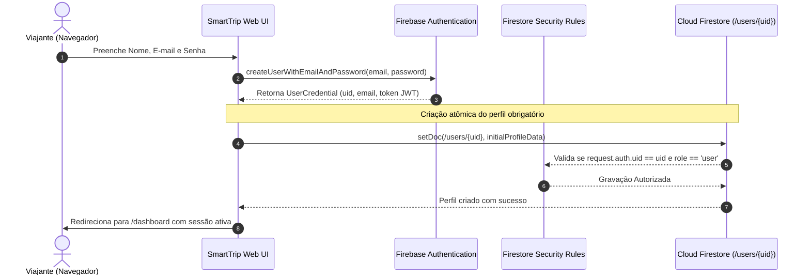

# SPEC de Autenticação e Gestão de Identidade: SmartTrip

**Documento:** `docs/specs/auth-spec.md`  
**Status:** Aprovado  
**Versão:** 1.0.0  
**Rastreabilidade:** [smarttrip-mestre.md](./smarttrip-mestre.md), [setup-operacional.md](./setup-operacional.md), [ui-spec.md](./ui-spec.md) e [firebase-spec.md](./firebase-spec.md)  
**Objetivo:** Especificar o ciclo de vida completo de autenticação e identidade dos usuários do SmartTrip utilizando o Firebase Authentication integrado ao Cloud Firestore, definindo fluxos de cadastro, login, logout, recuperação de acesso, criação atômica de perfil sob `/users/{uid}`, controle de papéis (*roles*) com bloqueio a autoelevação e proteção estrita de dados baseada no token JWT autenticado.

---

## 1. Visão Geral da Arquitetura de Identidade

A segurança de dados do SmartTrip segue o princípio de **Confiança Zero no Cliente** (*Zero Trust Client Identity*). O identificador do usuário (`userId`) provém **exclusivamente do token de autenticação emitido pelo Firebase Authentication** (`request.auth.uid`), nunca de parâmetros, cabeçalhos ou campos do corpo enviados manipuláveis pelo navegador.



---

## 2. Contratos de Tipagem e Esquema de Dados

### 2.1. Contrato de Perfil de Usuário (`/users/{uid}`)

```typescript
export type UserRole = 'user' | 'admin';

export interface UserPreferences {
  travelStyle: 'cultura' | 'natureza' | 'gastronomia' | 'aventura' | 'relaxamento';
  budgetLevel: 'economico' | 'moderado' | 'luxo';
  pace: 'tranquilo' | 'moderado' | 'intenso';
  dietaryRestrictions: string[]; // Ex: ["Vegetariano", "Sem Glúten"]
}

export interface UserProfileDocument {
  uid: string;
  email: string;
  displayName: string;
  photoURL?: string;
  role: UserRole; // Padrão: 'user'
  preferences: UserPreferences;
  createdAt: any; // FieldValue.serverTimestamp()
  updatedAt: any; // FieldValue.serverTimestamp()
}
```

### 2.2. Contratos da Camada de Autenticação (`AuthContext` / `useAuth`)

```typescript
export interface AuthState {
  user: UserProfileDocument | null;
  firebaseUser: any | null; // Objeto User nativo do Firebase Auth
  isLoading: boolean;
  isAuthenticated: boolean;
}

export interface AuthContextType extends AuthState {
  signUpWithEmail: (name: string, email: string, pass: string) => Promise<void>;
  signInWithEmail: (email: string, pass: string) => Promise<void>;
  signInWithGoogle: () => Promise<void>;
  sendPasswordReset: (email: string) => Promise<void>;
  signOutUser: () => Promise<void>;
}
```

---

## 3. Fluxos Operacionais e Regras de Negócio

### 3.1. Cadastro por E-mail e Senha (`signUpWithEmail`)
1. **Validação no Cliente:** E-mail com formato válido; senha com no mínimo 6 caracteres; confirmação idêntica.
2. **Criação no Firebase Auth:** Invoca `createUserWithEmailAndPassword`.
3. **Provisionamento do Documento de Perfil:**
   - Cria o documento na coleção `/users/{uid}` utilizando o UID obtido do Auth.
   - Atribui obrigatoriamente `role: "user"`.
   - Inicializa as preferências padrão (`travelStyle: 'cultura'`, `budgetLevel: 'moderado'`, `pace: 'tranquilo'`, `dietaryRestrictions: []`).
   - Carimba `createdAt` e `updatedAt` com `serverTimestamp()`.
4. **Redirecionamento:** Transiciona o usuário autenticado para `/dashboard`.

### 3.2. Login por E-mail e Senha (`signInWithEmail`)
1. Invoca `signInWithEmailAndPassword`.
2. O observador `onAuthStateChanged` captura a emissão do token e busca o documento `/users/{uid}` correspondente no Firestore.
3. Atualiza o estado global de autenticação e redireciona para `/dashboard` (ou para a rota que o usuário tentava acessar originalmente).

### 3.3. Login Social com Google OAuth (`signInWithGoogle`)
1. Abre pop-up via `signInWithPopup(auth, googleProvider)`.
2. Se o documento `/users/{uid}` já existir no Firestore, carrega os dados existentes.
3. Se for o primeiro acesso, provisiona automaticamente `/users/{uid}` com `displayName`, `photoURL`, `email` do provedor e `role: "user"`.

### 3.4. Recuperação de Senha (`sendPasswordReset`)
1. Invoca `sendPasswordResetEmail(auth, email)`.
2. O Firebase envia e-mail com link de redefinição de chave pública com token de expiração temporária.
3. Exibe mensagem clara: *"E-mail de redefinição enviado! Verifique sua caixa de entrada e spam."*.

### 3.5. Logout (`signOutUser`)
1. Invoca `signOut(auth)`.
2. O token local é invalidado no navegador.
3. Limpa o estado em memória (`user: null`, `isAuthenticated: false`).
4. Redireciona imediatamente para `/login` ou `/`.

---

## 4. Proteção de Rotas e Redirecionamentos

| Rota | Tipo | Comportamento se NÃO Autenticado | Comportamento se Autenticado |
|---|---|---|---|
| `/` | Pública | Exibe Landing Page com botões "Entrar" e "Começar" | Exibe Landing Page com botão direto para "Ir ao Dashboard" |
| `/login` | Pública / Guest | Permite preenchimento do formulário | **Redireciona imediatamente para `/dashboard`** |
| `/register` | Pública / Guest | Permite preenchimento do formulário | **Redireciona imediatamente para `/dashboard`** |
| `/dashboard` | **Privada** | **Redireciona para `/login`** | Acesso concedido |
| `/profile` | **Privada** | **Redireciona para `/login`** | Acesso concedido |
| `/availability` | **Privada** | **Redireciona para `/login`** | Acesso concedido |
| `/explore` | **Privada** | **Redireciona para `/login`** | Acesso concedido |
| `/trips` | **Privada** | **Redireciona para `/login`** | Acesso concedido |
| `/trips/[id]` | **Privada** | **Redireciona para `/login`** | Acesso concedido (se a viagem pertencer ao usuário) |

---

## 5. Prevenção de Confiança no Cliente e Proteção contra Autoelevação

### 5.1. O Risco de Autoelevação (*Role Privilege Escalation*)
Em aplicações conectadas diretamente ao Firestore pelo Client SDK, um usuário com conhecimentos técnicos pode tentar enviar uma requisição modificada contendo `{ role: "admin" }` para obter privilégios indevidos.

### 5.2. A Solução Obrigatória: Firestore Security Rules com Bloqueio de Role
O arquivo de regras (`firestore.rules`) deve bloquear expressamente qualquer tentativa de criar ou atualizar um documento com `role: "admin"` a partir do cliente:

```javascript
rules_version = '2';
service cloud.firestore {
  match /databases/{database}/documents {

    // Helper functions de segurança
    function isSignedIn() {
      return request.auth != null;
    }
    
    function isOwner(userId) {
      return isSignedIn() && request.auth.uid == userId;
    }

    // Regras de Perfil e Papéis (/users/{userId})
    match /users/{userId} {
      allow read: if isOwner(userId);
      
      // Criação de perfil: permite se for o próprio usuário E a role for estritamente 'user'
      allow create: if isOwner(userId) 
        && request.resource.data.uid == userId
        && request.resource.data.role == 'user';

      // Atualização de perfil: o próprio usuário pode alterar dados,
      // MAS é proibido alterar o campo 'role' (impede autoelevação)
      allow update: if isOwner(userId) 
        && request.resource.data.role == resource.data.role;

      // Exclusão de perfil: apenas pelo próprio usuário
      allow delete: if isOwner(userId);

      // Subcoleções isoladas por UID
      match /vacationPeriods/{periodId} {
        allow read, write: if isOwner(userId);
      }

      match /trips/{tripId} {
        allow read, write: if isOwner(userId);
      }
    }
  }
}
```

> 🛡️ **Garantia de Segurança:** Promoções para o papel `admin` só podem ser executadas através do **Firebase Admin SDK** (server-side seguro) ou via Custom Claims com assinatura criptográfica do Firebase.

---

## 6. Mapeamento Amigável de Códigos de Erro

Para evitar mensagens técnicas em inglês na interface, a camada de autenticação deve interceptar os códigos do Firebase e convertê-los para o usuário:

| Código Firebase Auth | Mensagem de Interface Apresentada |
|---|---|
| `auth/invalid-email` | "O formato do e-mail inserido é inválido." |
| `auth/user-disabled` | "Esta conta de usuário foi temporariamente desativada." |
| `auth/user-not-found` | "Nenhum usuário cadastrado com este e-mail." |
| `auth/wrong-password` | "Senha incorreta. Tente novamente ou redefina sua senha." |
| `auth/invalid-credential` | "E-mail ou senha incorretos." |
| `auth/email-already-in-use` | "Este endereço de e-mail já está em uso por outra conta." |
| `auth/weak-password` | "A senha deve ter no mínimo 6 caracteres." |
| `auth/popup-closed-by-user` | "O login com o Google foi cancelado antes da conclusão." |
| `auth/network-request-failed` | "Falha de conexão. Verifique sua internet e tente novamente." |

---

## 7. Critérios de Aceite Verificáveis (CA-AUTH)

- **CA-AUTH-001 (Cadastro Válido):** Criar conta com e-mail/senha válidos cria o registro no Firebase Auth e o documento correspondente `/users/{uid}` com `role: "user"`.
- **CA-AUTH-002 (Bloqueio de Senha Curta):** Senhas com menos de 6 caracteres são rejeitadas pelo cliente antes do envio, com feedback visual imediato.
- **CA-AUTH-003 (Login Bem-Sucedido):** Usuário registrado consegue logar e sua sessão é mantida após recarregar a página (`F5`).
- **CA-AUTH-004 (Logout Seguro):** Clicar em "Sair da Conta" destrói o token local, limpa o estado de usuário e redireciona para `/login`.
- **CA-AUTH-005 (Proteção de Rota Privada):** Tentar acessar `/dashboard`, `/profile`, `/availability`, `/explore` ou `/trips` sem login redireciona compulsoriamente para `/login`.
- **CA-AUTH-006 (Anti-Autoelevação):** Uma requisição direta do cliente tentando gravar `{ role: "admin" }` no documento `/users/{uid}` é sumariamente rejeitada pelo Firestore com código de erro `permission-denied`.
- **CA-AUTH-007 (Isolamento entre Usuários Distintos):**
  - O **Usuário A** autenticado (`uid: "user_clara"`) tem permissão de leitura e escrita em `/users/user_clara/trips`.
  - O **Usuário B** autenticado (`uid: "user_lucas"`) tem permissão em `/users/user_lucas/trips`.
  - O **Usuário A** é rigorosamente bloqueado de ler ou modificar qualquer documento em `/users/user_lucas/trips` e vice-versa.

---

## 8. Estratégia de Testes Automatizados com Dois Usuários

Para validar os requisitos de isolamento e regras de segurança, deve ser executada a suíte de testes com dois usuários sintéticos distintos:

```text
Cenário de Teste de Isolamento Multi-Usuário:
1. Contexto A: Usuário Autenticado "Clara" (UID: "uid_clara_101", Role: "user")
2. Contexto B: Usuário Autenticado "Lucas" (UID: "uid_lucas_202", Role: "user")

Passo 1: Clara cria seu perfil em /users/uid_clara_101 -> DEVE PASSAR (PASS)
Passo 2: Clara tenta criar perfil com role: 'admin' -> DEVE FALHAR (PASS - Bloqueio de autoelevação)
Passo 3: Clara cria uma viagem em /users/uid_clara_101/trips/trip_lisboa -> DEVE PASSAR (PASS)
Passo 4: Lucas autentica e tenta ler /users/uid_clara_101/trips/trip_lisboa -> DEVE FALHAR com permission-denied (PASS)
Passo 5: Lucas tenta excluir a viagem de Clara -> DEVE FALHAR com permission-denied (PASS)
Passo 6: Lucas cria sua própria viagem em /users/uid_lucas_202/trips/trip_toquio -> DEVE PASSAR (PASS)
Passo 7: Clara tenta listar as viagens de Lucas -> DEVE FALHAR com permission-denied (PASS)
```
