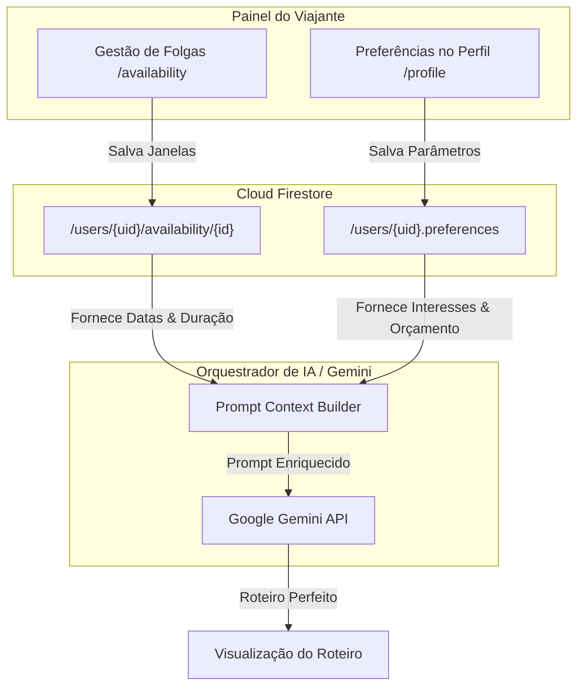

# SPEC Conjunta: Períodos de Folga (Disponibilidade) e Preferências de Viagem

**Documento:** `docs/specs/availability-preferences-spec.md`  
**Status:** Aprovado  
**Versão:** 1.0.0  
**Rastreabilidade:** [smarttrip-mestre.md](./smarttrip-mestre.md), [ui-spec.md](./ui-spec.md), [firebase-spec.md](./firebase-spec.md) e [firestore-model.md](./firestore-model.md)  
**Objetivo:** Especificar a experiência do usuário (UX), modelo de dados, validações de negócio, regras de autorização, critérios de aceite e tratamento de casos extremos para as duas forças de personalização da IA no SmartTrip: **(A) Períodos de Folga (Disponibilidade)** e **(B) Preferências de Viagem**.

---

## 1. Visão Sistêmica e Papel na IA

O motor de IA (Google Gemini) requer dois pilares fundamentais para gerar itinerários que façam sentido no mundo real:
1. **Onde e Quando Cabem Viagens (Disponibilidade):** A IA só deve sugerir planos que caibam rigorosamente nas janelas de folga do viajante, respeitando datas de início, término e notas contextuais.
2. **Como o Viajante Gosta de Viajar (Preferências):** A IA filtra destinos, atrações, meios de transporte e ritmo com base nos interesses declarados, nível orçamentário, tolerância a distâncias e preferências climáticas.



---

## 2. Parte A: Períodos de Folga (Disponibilidade)

### 2.1. Modelo Conceitual e Campos
Armazenado na subcoleção `/users/{userId}/availability/{availabilityId}`.

| Campo | Tipo | Obrigatório | Descrição |
|---|---|:---:|---|
| `id` | `string` | Sim | Identificador único (`vac_` + timestamp ou auto-id). |
| `title` | `string` | Sim | Título descritivo do período (ex: "Recesso de Carnaval"). |
| `startDate` | `string` | Sim | Data inicial em formato ISO 8601 (`YYYY-MM-DD`). |
| `endDate` | `string` | Sim | Data final em formato ISO 8601 (`YYYY-MM-DD`). |
| `totalDays` | `number` | Sim | Quantidade de dias calculada inclusivamente. |
| `notes` | `string` | Não | Observações contextuais livres (ex: "Não quero pegar voos na madrugada"). |
| `createdAt` | `timestamp` | Sim | Carimbo de data/hora de criação no servidor. |
| `updatedAt` | `timestamp` | Sim | Carimbo de data/hora da última alteração. |

### 2.2. Experiência do Usuário (UX) na Tela `/availability`
- **Lista Cronológica de Folgas:** Exibe cards compactos com contagem regressiva, datas formatadas e tags de duração.
- **Formulário / Modal Intuitivo:**
  - Campo de Título com autossugestões comuns ("Férias de Julho", "Recesso de Fim de Ano", "Feriado Prolongado").
  - Calendário com seletores de data inicial e final.
  - Campo de texto para `notes`.
  - Prévia em tempo real: *"Duração calculada: X dias livres"*.
- **Ações:** Botão de Adicionar, botão de Edição rápida e botão de Exclusão com confirmação visual.

### 2.3. Validações e Regras de Negócio de Disponibilidade
- **VAL-DISP-001 (Consistência Cronológica):** `endDate` deve ser maior ou igual a `startDate`.
- **VAL-DISP-002 (Cálculo Inclusivo):** `totalDays = Math.ceil((endDate - startDate) / 1 dia) + 1`.
- **VAL-DISP-003 (Datas Passadas):** Folgas totalmente passadas em relação à data atual devem ser exibidas com estilo de arquivo histórico e não devem ser sugeridas pelo planejador.
- **VAL-DISP-004 (Tratamento de Conflitos / Sobreposições):**
  - Caso o usuário tente salvar um período que se sobreponha parcialmente ou totalmente a um período já existente, o sistema **não bloqueia rigidamente**, mas exibe um alerta visual amigável:
    > ⚠️ *"Atenção: Este período coincide com 'Férias de Outono' (12 a 18/10). Deseja salvar mesmo assim ou mesclar os períodos?"*
  - O usuário tem autonomia para prosseguir ou ajustar as datas.

---

## 3. Parte B: Preferências de Viagem

### 3.1. Modelo Conceitual e Campos
Armazenado embutido no documento de perfil `/users/{userId}` no mapa `preferences`.

| Campo | Tipo | Obrigatório | Descrição / Valores Aceitos |
|---|---|:---:|---|
| `interests` | `array of string` | Sim | Categorias turísticas: `['cultura', 'natureza', 'gastronomia', 'aventura', 'compras', 'relaxamento', 'vida_noturna']`. |
| `budgetLevel` | `string` | Sim | Nível orçamentário: `'economico'` (hostels/gratuitos), `'moderado'` (hotéis 3-4 estrelas/restaurantes padrão), `'luxo'` (alta gastronomia/conforto). |
| `pace` | `string` | Sim | Ritmo diário: `'tranquilo'` (1 a 2 atrações), `'moderado'` (3 a 4), `'intenso'` (5+ com cronograma dinâmico). |
| `transportation` | `array of string` | Sim | Meios de locomoção preferidos: `['caminhada', 'transporte_publico', 'carro_alugado', 'taxi_uber']`. |
| `preferredClimate` | `string` | Sim | Clima desejado: `'ensolarado_quente'`, `'ameno_fresco'`, `'frio_neve'`, `'indiferente'`. |
| `maxDistanceKm` | `number` | Sim | Raio máximo desejado de deslocamento a partir do centro (ex: `15` km no MVP). |
| `dietaryRestrictions`| `array of string` | Sim | Restrições alimentares: `['vegetariano', 'vegano', 'sem_gluten', 'sem_lactose', 'halal', 'kosher']`. |

### 3.2. Experiência do Usuário (UX) na Tela `/profile`
- **Seletores em Chips / Tags Interativas:** O usuário clica para marcar ou desmarcar interesses e meios de transporte, com ícones representativos e realce de cor quando selecionado.
- **Slider / Seletor de Orçamento:** Alternância clara entre "Econômico", "Moderado" e "Luxo" com explicações contextuais de gastos diários médios.
- **Feedback Imediato:** Botão "Salvar Alterações" bloqueado caso nenhum interesse seja marcado, com exibição de Toast de confirmação ao gravar no Firestore.

---

## 4. Persistência e Autorização (Security Rules)

Ambas as entidades obedecem à regra estrita de **Ownership**:

```javascript
// firestore.rules
match /users/{userId} {
  // Apenas o próprio usuário autenticado pode ler ou alterar suas preferências
  allow read, write: if request.auth != null && request.auth.uid == userId;

  // Apenas o próprio usuário autenticado pode criar, ler, editar ou excluir suas folgas
  match /availability/{availabilityId} {
    allow read, write: if request.auth != null && request.auth.uid == userId;
  }
}
```

---

## 5. Casos Extremos (*Edge Cases*) e Tratamento de Exceções

| Caso Extremo | Comportamento Esperado do Sistema |
|---|---|
| **Folga de apenas 1 dia (`startDate === endDate`)** | Permitido. O sistema registra `totalDays = 1` e sugere roteiro no formato "Bate e Volta / Day Trip". |
| **Folga superior a 30 dias** | Permitido o cadastro da folga inteira, mas ao gerar o roteiro com Gemini, o sistema avisa que o MVP gera no máximo 7 dias consecutivos por requisição. |
| **Ano Bissexto / Transição de Mês (ex: 28/02 a 02/03)** | Validação nativa via biblioteca `Date` JS/TypeScript sem erros de *off-by-one*. |
| **Nenhum interesse marcado pelo usuário** | O formulário força a seleção de ao menos 1 interesse primário antes de salvar. |
| **Notas com caracteres especiais ou quebras de linha** | Sanitização contra XSS e limitação a 500 caracteres para evitar poluição visual. |
| **Edição de folga que já possui roteiro vinculado** | O sistema atualiza o período de folga e notifica o usuário caso o roteiro existente precise de readequação de datas. |

---

## 6. Critérios de Aceite Verificáveis (CA-DISP-PREF)

- **CA-DISP-001 (CRUD Completo de Folgas):** O usuário deve conseguir criar, visualizar na lista, editar datas/título/notas e excluir qualquer período de folga de sua conta.
- **CA-DISP-002 (Bloqueio de Intervalo Negativo):** Tentativa de salvar período onde `endDate < startDate` deve ser barrada no cliente com mensagem de erro explícita e código de erro nos repositórios.
- **CA-DISP-003 (Persistência de Notas):** O campo opcional `notes` deve ser persistido e recarregado fielmente na edição.
- **CA-PREF-001 (Configuração Completa de Preferências):** O usuário deve conseguir definir interesses, orçamento, ritmo, meios de transporte, clima preferido e distância máxima.
- **CA-PREF-002 (Isolamento de Segurança):** O Usuário A não pode ter visibilidade nem alterar os períodos de folga ou preferências do Usuário B.
- **CA-PREF-003 (Integração com Prompt da IA):** O módulo orquestrador do Gemini deve consumir diretamente essas preferências para compor as diretrizes de personalização do prompt.
