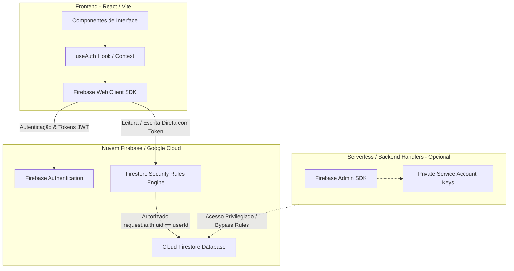

# SPEC Técnica de Integração Firebase: SmartTrip

**Documento:** `docs/specs/firebase-spec.md`  
**Status:** Aprovado  
**Versão:** 1.0.0  
**Rastreabilidade:** [smarttrip-mestre.md](./smarttrip-mestre.md), [setup-operacional.md](./setup-operacional.md) e [ui-spec.md](./ui-spec.md)  
**Objetivo:** Estabelecer a arquitetura técnica de integração com a plataforma Firebase, padronizando autenticação de usuários, persistência NoSQL no Cloud Firestore, separação entre Client e Admin SDK, isolamento de variáveis públicas vs. privadas, ciclo de vida singleton, ambientes de deploy, regras de segurança obrigatórias e critérios de aceite rastreáveis.

---

## 1. Visão Geral da Arquitetura Firebase no SmartTrip

A persistência e o controle de identidade do SmartTrip assentam-se sobre o ecossistema Google Cloud / Firebase:
- **Firebase Authentication:** Gestão segura do ciclo de vida dos viajantes (criação de conta, login por e-mail/senha, Google OAuth, renovação de tokens JWT e logout).
- **Cloud Firestore:** Banco de dados NoSQL orientado a documentos e subcoleções, provendo baixa latência, sincronização em tempo real e isolamento por UID.
- **Firebase Storage (Extensão Futura / Opcional):** Não integra o escopo MVP obrigatório; catalogado como extensão para upload de fotos personalizadas de capa no pós-MVP.



---

## 2. Diferenciação Arquitetural: Client SDK vs. Admin SDK

Para preservar a integridade e segurança do sistema, deve ser respeitada a fronteira estrita entre as duas bibliotecas:

| Dimensão | Firebase Web Client SDK (`firebase/app`) | Firebase Admin SDK (`firebase-admin`) |
|---|---|---|
| **Onde Executa** | Navegador do usuário (Frontend / SPA / SSR Client) | Ambiente servidor seguro (Node.js, Edge/Serverless APIs) |
| **Identidade Operacional** | Representa o usuário logado via token JWT | Representa a aplicação com privilégios de superusuário |
| **Sujeito a Security Rules?** | **SIM** (Bloqueado se violar `firestore.rules`) | **NÃO** (Bypass total das regras de segurança) |
| **Uso no MVP** | **Obrigatório** (Auth + Firestore em tempo real) | **Opcional / Restrito** (Seed scripts ou rotas de retaguarda) |
| **Credenciais** | Chaves públicas de identificação do projeto | Chave privada de conta de serviço (*Service Account Key*) |

---

## 3. Gestão de Variáveis de Ambiente: Públicas vs. Privadas

### 3.1. Variáveis Públicas do Cliente (Client SDK)
As chaves do Firebase Web Client SDK são identificadores de projeto (não são segredos de criptografia) e precisam ser expostas ao navegador sob o prefixo exigido pelo empacotador (ex: `VITE_` ou `NEXT_PUBLIC_`). A segurança não depende de escondê-las, mas sim das **Firestore Security Rules**.

- `VITE_FIREBASE_API_KEY`: Identificador da chave de API do projeto no Google Cloud.
- `VITE_FIREBASE_AUTH_DOMAIN`: Domínio de autorização OAuth (ex: `<projeto>.firebaseapp.com`).
- `VITE_FIREBASE_PROJECT_ID`: ID canônico do projeto Firebase.
- `VITE_FIREBASE_STORAGE_BUCKET`: URL do bucket de storage padrão.
- `VITE_FIREBASE_MESSAGING_SENDER_ID`: ID numérico do remetente de mensageria.
- `VITE_FIREBASE_APP_ID`: Identificador da aplicação web registrada.

### 3.2. Variáveis Privadas de Servidor (Admin SDK & Gemini)
Devem residir estritamente no runtime seguro do servidor (Vercel Environment Variables ou `.env.local`), sem nenhum prefixo público:
- `GEMINI_API_KEY`: Segredo de acesso à API generativa do Google.
- `FIREBASE_ADMIN_SERVICE_ACCOUNT`: JSON ou variáveis contendo `client_email` e `private_key` da conta de serviço.

---

## 4. Padrão de Inicialização Singleton e Prevenção de Múltiplas Instâncias

### 4.1. O Problema
No ecossistema React com Fast Refresh / Hot Module Replacement (HMR) e em cenários de renderização sob demanda, a importação repetida do arquivo de configuração pode invocar `initializeApp()` múltiplas vezes, gerando o erro de runtime `FirebaseError: Firebase: Firebase App named '[DEFAULT]' already exists`.

### 4.2. Estratégia de Implementação Singleton
A inicialização do Firebase Client deve verificar se já existe uma aplicação ativa via `getApps()` antes de registrar uma nova:

```typescript
// Contrato de Inicialização Singleton (src/services/firebase/client.ts)
import { initializeApp, getApps, getApp, FirebaseApp } from 'firebase/app';
import { getAuth, Auth } from 'firebase/auth';
import { getFirestore, Firestore } from 'firebase/firestore';

const firebaseConfig = {
  apiKey: import.meta.env.VITE_FIREBASE_API_KEY,
  authDomain: import.meta.env.VITE_FIREBASE_AUTH_DOMAIN,
  projectId: import.meta.env.VITE_FIREBASE_PROJECT_ID,
  storageBucket: import.meta.env.VITE_FIREBASE_STORAGE_BUCKET,
  messagingSenderId: import.meta.env.VITE_FIREBASE_MESSAGING_SENDER_ID,
  appId: import.meta.env.VITE_FIREBASE_APP_ID,
};

// Singleton seguro contra HMR e re-render
export const app: FirebaseApp = getApps().length === 0 ? initializeApp(firebaseConfig) : getApp();
export const auth: Auth = getAuth(app);
export const db: Firestore = getFirestore(app);
```

---

## 5. Estratégia Multiambiente (Development / Preview / Production)

O SmartTrip deve operar de forma consistente em três estágios de ciclo de vida:

1. **Development (Local):**
   - Execução via `npm run dev` na máquina do desenvolvedor.
   - Variáveis carregadas do arquivo local `.env.local`.
   - Pode conectar ao projeto Firebase de homologação ou aos Emuladores Locais do Firebase (`firebase emulators:start`).
2. **Preview (Pull Requests / Vercel Preview):**
   - Builds temporários gerados automaticamente pela Vercel para revisão de código.
   - Utiliza chaves de ambiente do tipo *Preview* apontando para o ambiente de testes/staging.
3. **Production (Main Branch / Vercel Production):**
   - Ambiente estável de produção acessível aos usuários finais.
   - Chaves de produção do Firebase configuradas de forma permanente nas variáveis da Vercel.

---

## 6. Estratégia para Timestamps e Datas no Cloud Firestore

### 6.1. O Problema das Datas Heterogêneas
Salvar datas puramente como strings ISO (`YYYY-MM-DDTHH:mm:ssZ`) ou inteiros de timestamp JS (`Date.now()`) no cliente acarreta divergências de fuso horário da máquina do usuário e impede consultas eficientes de ordenação e filtros no Firestore.

### 6.2. Estratégia Mandatória de Timestamps
- **Campos de Auditoria do Documento:**
  - `createdAt` e `updatedAt`: Devem ser gerados no momento da gravação utilizando `serverTimestamp()` do SDK (`firebase/firestore`). O servidor do Google garante o carimbo de tempo autoritativo e imune a relógios desajustados do cliente.
- **Campos de Negócio de Viagem e Folgas:**
  - `startDate` e `endDate`: Devem ser padronizados como strings literais de calendário no formato **ISO 8601 Date** (`YYYY-MM-DD`, ex: `"2026-10-12"`), eliminando distorções de conversão para fusos horários locais no momento de exibição.

---

## 7. Requisito Obrigatório: Firestore Security Rules

As regras de segurança constituem o **único mecanismo de blindagem** contra leitura e escrita indevida por usuários mal-intencionados com acesso às chaves públicas do Client SDK. Nenhum documento pode ser acessado sem autenticação e validação estrita de propriedade.

### 7.1. Modelo Conceitual de Coleções e Subcoleções
```text
/users/{userId}
   ├── (documento do perfil)
   │
   ├── /vacationPeriods/{periodId}
   │      └── (períodos de folga do usuário)
   │
   └── /trips/{tripId}
          └── (roteiros e viagens do usuário)
```

### 7.2. Contrato Obrigatório de Segurança (`firestore.rules`)
```javascript
rules_version = '2';
service cloud.firestore {
  match /databases/{database}/documents {

    // Bloqueio irrestrito por padrão em coleções raiz não autorizadas
    match /{document=**} {
      allow read, write: if false;
    }

    // Regras para Documento de Perfil de Usuário
    match /users/{userId} {
      // Usuário autenticado só pode ler e escrever em seu próprio documento
      allow read, write: if request.auth != null && request.auth.uid == userId;

      // Regras para Subcoleção de Períodos de Folga
      match /vacationPeriods/{periodId} {
        allow read, write: if request.auth != null && request.auth.uid == userId;
      }

      // Regras para Subcoleção de Viagens e Roteiros
      match /trips/{tripId} {
        allow read, write: if request.auth != null && request.auth.uid == userId;
      }
    }
  }
}
```

---

## 8. Arquitetura Modular de Arquivos Conceituais

A integração com o Firebase deve ser organizada sob uma estrutura modular em `src/services/firebase/` para desacoplar a lógica do banco dos componentes de UI:

```text
src/services/firebase/
├── client.ts              # Inicialização singleton do Firebase Client (App, Auth, Firestore)
├── authService.ts         # Métodos puros de autenticação (signInWithEmail, signInWithGoogle, logout)
├── profileService.ts      # CRUD de perfil e preferências (/users/{userId})
├── vacationService.ts     # CRUD de folgas (/users/{userId}/vacationPeriods)
├── tripService.ts         # CRUD de viagens e roteiros (/users/{userId}/trips)
└── errorHandling.ts       # Mapeamento de códigos de erro Firebase (ex: auth/wrong-password)
```

### 8.1. Responsabilidades de Cada Módulo
1. **`client.ts`:** Garantir que o Firebase seja inicializado uma única vez com validação da presença das variáveis de ambiente.
2. **`authService.ts`:** Encapsular observadores de sessão (`onAuthStateChanged`), tokens e login social.
3. **`profileService.ts`:** Buscar e atualizar as tags de estilo, ritmo, restrições e biografia do viajante.
4. **`tripService.ts`:** Executar gravações de novos roteiros com `serverTimestamp()`, listagens ordenadas por `startDate` e exclusões atômicas.
5. **`errorHandling.ts`:** Traduzir erros técnicos do Firebase para mensagens amigáveis em português exibíveis via Toast.

---

## 9. Riscos Técnicos e Mitigações

| ID | Risco Técnico | Impacto | Probabilidade | Estratégia de Mitigação |
|---|---|---|---|---|
| **RK-FB-001** | Inicialização duplicada do Firebase em ambiente HMR/React Fast Refresh | Alto | Média | Utilizar estritamente o padrão Singleton com verificação `getApps().length === 0`. |
| **RK-FB-002** | Exposição de chaves privadas do Admin SDK no bundle web | Crítico | Baixa | Proibir importações de `firebase-admin` em arquivos de componentes React e monitorar o `.gitignore`. |
| **RK-FB-003** | Fuga de dados entre usuários por ausência de Security Rules | Crítico | Média | Adotar Security Rules baseadas no path `/users/{userId}/...` com validação de `request.auth.uid`. |
| **RK-FB-004** | Latência ou desajuste de datas entre clientes em fusos distintos | Médio | Média | Empregar `serverTimestamp()` para auditoria e strings `YYYY-MM-DD` para datas de calendário. |
| **RK-FB-005** | Falha de carregamento no primeiro acesso por ausência temporária de chaves `.env` | Baixo | Média | Validar a presença das chaves no boot e apresentar aviso de configuração amigável na UI sem quebrar a aplicação. |

---

## 10. Critérios de Aceite da Integração Firebase (CA-FB)

- **CA-FB-001 (Singleton):** A importação repetida ou recarregamento a quente da aplicação não deve lançar exceção de `[DEFAULT] already exists`.
- **CA-FB-002 (Autenticação E-mail/Senha):** Usuários cadastrados com e-mail e senha devem conseguir efetuar login e obter sessão persistida no `localStorage` pelo SDK.
- **CA-FB-003 (Google OAuth):** O fluxo de login com Google deve abrir pop-up nativo e retornar credenciais com UID e e-mail válidos.
- **CA-FB-004 (Isolamento de Dados no Firestore):** Um usuário autenticado com UID `user_A` deve ser impedido de ler ou alterar os dados de `/users/user_B/trips` pelas regras do Firestore.
- **CA-FB-005 (Timestamps Consistentes):** A criação de viagens e folgas deve persistir os campos `createdAt` e `updatedAt` através do método `serverTimestamp()`.
- **CA-FB-006 (Tratamento de Sessão Expirada):** O logout deve revogar a sessão do cliente e redirecionar imediatamente para a tela `/login`.

---

## 11. Estratégia de Testes

### 11.1. Testes Automatizados de Regras de Segurança
- **Ferramenta:** `@firebase/rules-unit-testing`.
- **Objetivo:** Submeter requisições simuladas ao Firestore Emulator comprovando que:
  - Usuários anônimos têm acesso negado a `/users/{userId}`.
  - O usuário autenticado consegue criar e ler em sua própria subcoleção.
  - O usuário autenticado recebe erro `PERMISSION_DENIED` ao tentar ler `/users/{outroUserId}/trips`.

### 11.2. Testes de Integração com Emuladores Locais
- **Cenário:** Inicialização do Firebase Emulator Suite com dados de teste para validação de fluxos completos de login, cadastro de preferências e persistência de viagens sem consumo da cota em nuvem.

### 11.3. Testes de Inicialização do Módulo Client
- **Cenário:** Validação unitária de que o módulo `src/services/firebase/client.ts` exporta as instâncias de `app`, `auth` e `db` prontas para consumo sem reinicializações concorrentes.
