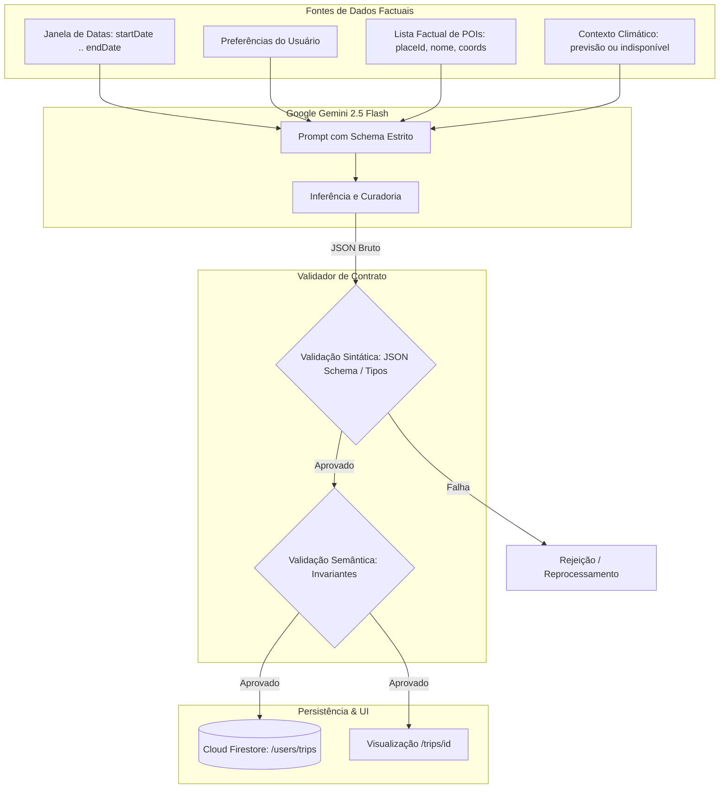
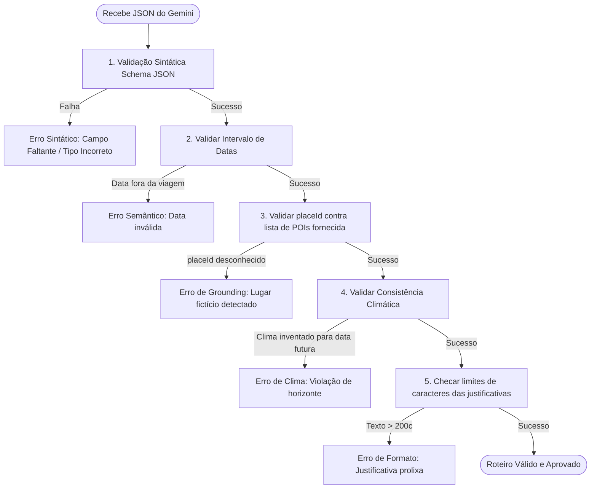

# Contrato Estruturado de Saída do Roteiro SmartTrip

**Documento:** `docs/specs/itinerary-contract-spec.md`  
**Papel:** Arquiteto de Contratos de Dados  
**Status:** Aprovado  
**Versão:** 1.0.0  
**Rastreabilidade:** [smarttrip-mestre.md](./smarttrip-mestre.md), [poi-service-spec.md](./poi-service-spec.md), [weather-service-spec.md](./weather-service-spec.md)  
**Público-Alvo:** Engenheiros de software, educadores e alunos de graduação/bootcamps implementando e validando integrações com IA Generativa (Google Gemini).

---

## 1. Visão Geral da Arquitetura do Contrato

O contrato estruturado de saída do roteiro é o **ponto de convergência factual** do SmartTrip. Ele define exatamente o formato JSON que o Google Gemini deve produzir (via *Structured Outputs* / JSON Schema) e que o backend/frontend deve validar antes de persistir no Cloud Firestore.



---

## 2. Schema JSON de Referência (JSON Schema Draft-07)

```json
{
  "$schema": "http://json-schema.org/draft-07/schema#",
  "title": "SmartTripItinerary",
  "description": "Contrato canônico de itinerário gerado pelo SmartTrip",
  "type": "object",
  "required": [
    "title",
    "summary",
    "destinationId",
    "startDate",
    "endDate",
    "days"
  ],
  "additionalProperties": false,
  "properties": {
    "title": {
      "type": "string",
      "minLength": 5,
      "maxLength": 100,
      "description": "Título atrativo e conciso para a viagem"
    },
    "summary": {
      "type": "string",
      "minLength": 20,
      "maxLength": 400,
      "description": "Visão geral e narrativa do itinerário gerado"
    },
    "destinationId": {
      "type": "string",
      "description": "Identificador canônico do destino normalizado"
    },
    "startDate": {
      "type": "string",
      "format": "date",
      "pattern": "^\\d{4}-\\d{2}-\\d{2}$",
      "description": "Data de início da viagem (YYYY-MM-DD)"
    },
    "endDate": {
      "type": "string",
      "format": "date",
      "pattern": "^\\d{4}-\\d{2}-\\d{2}$",
      "description": "Data de término da viagem (YYYY-MM-DD)"
    },
    "alerts": {
      "type": "array",
      "items": { "type": "string", "maxLength": 160 },
      "description": "Alertas globais da viagem (chuva, reservas antecipadas ou feriados). Pode ser lista vazia."
    },
    "days": {
      "type": "array",
      "minItems": 1,
      "maxItems": 14,
      "items": {
        "$ref": "#/definitions/ItineraryDay"
      }
    }
  },
  "definitions": {
    "ItineraryDay": {
      "type": "object",
      "required": [
        "dayNumber",
        "date",
        "weather",
        "theme",
        "activities"
      ],
      "additionalProperties": false,
      "properties": {
        "dayNumber": {
          "type": "integer",
          "minimum": 1,
          "maximum": 14,
          "description": "Índice sequencial do dia (1, 2, 3...)"
        },
        "date": {
          "type": "string",
          "format": "date",
          "pattern": "^\\d{4}-\\d{2}-\\d{2}$",
          "description": "Data específica do dia no formato ISO (YYYY-MM-DD)"
        },
        "theme": {
          "type": "string",
          "minLength": 3,
          "maxLength": 80,
          "description": "Foco temático do dia (ex: 'Imersão em Arte & Alta Gastronomia')"
        },
        "weather": {
          "type": "object",
          "required": [
            "hasForecast",
            "observation"
          ],
          "additionalProperties": false,
          "properties": {
            "hasForecast": {
              "type": "boolean",
              "description": "Indica se há modelo meteorológico numérico disponível"
            },
            "tempMin": {
              "type": ["integer", "null"],
              "description": "Temperatura mínima em °C ou null se fora do horizonte"
            },
            "tempMax": {
              "type": ["integer", "null"],
              "description": "Temperatura máxima em °C ou null se fora do horizonte"
            },
            "condition": {
              "type": "string",
              "enum": [
                "Ensolarado",
                "Parcialmente Nublado",
                "Nublado",
                "Chuvoso",
                "Tempestade",
                "Neve",
                "Desconhecido"
              ],
              "description": "Condição climática canônica"
            },
            "observation": {
              "type": "string",
              "maxLength": 160,
              "description": "Observação climática contextual ou aviso de indisponibilidade"
            }
          }
        },
        "alerts": {
          "type": "array",
          "items": { "type": "string", "maxLength": 160 },
          "description": "Alertas específicos do dia. Pode ser lista vazia []."
        },
        "activities": {
          "type": "array",
          "minItems": 1,
          "maxItems": 6,
          "items": {
            "$ref": "#/definitions/ItineraryActivity"
          }
        }
      }
    },
    "ItineraryActivity": {
      "type": "object",
      "required": [
        "placeId",
        "name",
        "period",
        "timeSlot",
        "rationale"
      ],
      "additionalProperties": false,
      "properties": {
        "placeId": {
          "type": "string",
          "minLength": 5,
          "maxLength": 120,
          "description": "Identificador do POI presente obrigatoriamente na lista fornecida"
        },
        "name": {
          "type": "string",
          "minLength": 2,
          "maxLength": 100,
          "description": "Nome oficial do local (idêntico ao POI fornecido)"
        },
        "period": {
          "type": "string",
          "enum": ["manha", "tarde", "noite"],
          "description": "Período do dia da atividade"
        },
        "timeSlot": {
          "type": "string",
          "pattern": "^([01]\\d|2[0-3]):[0-5]\\d$",
          "description": "Horário sugerido de início no formato HH:MM (ex: '09:30')"
        },
        "rationale": {
          "type": "string",
          "minLength": 10,
          "maxLength": 200,
          "description": "Justificativa concisa da escolha segundo perfil ou clima. Não usar textos longos."
        },
        "estimatedDuration": {
          "type": "string",
          "maxLength": 40,
          "description": "Duração estimada (ex: '2h', '1h30m', '3h')"
        },
        "curatorTip": {
          "type": "string",
          "maxLength": 150,
          "description": "Dica prática opcional de curadoria (ex: 'Compre ingresso online')"
        }
      }
    }
  }
}
```

---

## 3. Definição Detalhada dos Campos e Obrigatoriedade

| Nível | Campo | Tipo | Obrigatório? | Limites / Regras | Descrição Pedagógica |
|---|---|---|:---:|---|---|
| **Raiz** | `title` | `string` | **Sim** | 5 a 100 chars | Título inspirador (ex: *"Paris Clássica e Gastronômica em 5 Dias"*). |
| **Raiz** | `summary` | `string` | **Sim** | 20 a 400 chars | Parágrafo conciso resumindo o tom geral e logística da viagem. |
| **Raiz** | `destinationId` | `string` | **Sim** | Não vazio | ID canônico do destino selecionado (`dest_fr_paris_*`). |
| **Raiz** | `startDate` | `string` | **Sim** | `YYYY-MM-DD` | Início estrito da janela da viagem. |
| **Raiz** | `endDate` | `string` | **Sim** | `YYYY-MM-DD` | Fim estrito da janela da viagem (`>= startDate`). |
| **Raiz** | `alerts` | `string[]` | Não (opc.) | Máx 5 itens, máx 160c | Alertas globais da viagem (pode ser `[]`). |
| **Raiz** | `days` | `array` | **Sim** | 1 a 14 itens | Lista cronológica dos dias do itinerário. |
| **Dia** | `dayNumber` | `integer` | **Sim** | 1 a 14 | Contador ordinal contínuo (Dia 1, Dia 2, etc.). |
| **Dia** | `date` | `string` | **Sim** | `YYYY-MM-DD` | Data exata do dia (`startDate <= date <= endDate`). |
| **Dia** | `theme` | `string` | **Sim** | 3 a 80 chars | Subtítulo conceitual para organização mental do viajante. |
| **Dia** | `weather` | `object` | **Sim** | Objeto estrito | Dados meteorológicos ou aviso de ausência. |
| `weather` | `hasForecast` | `boolean` | **Sim** | `true` ou `false` | Se `false`, `tempMin` e `tempMax` **devem ser `null`**. |
| `weather` | `tempMin` | `int / null` | **Sim** | -50 a 60 ou `null` | Temperatura mínima (°C). |
| `weather` | `tempMax` | `int / null` | **Sim** | -50 a 60 ou `null` | Temperatura máxima (°C). |
| `weather` | `condition` | `enum` | **Sim** | 7 valores | Condição canônica (ou `'Desconhecido'`). |
| `weather` | `observation`| `string` | **Sim** | 5 a 160 chars | Observação meteorológica contextual ou nota de indisponibilidade. |
| **Dia** | `alerts` | `string[]` | Não (opc.) | Máx 5 itens, máx 160c | Alertas específicos do dia (ex: chuva forte). Pode ser `[]`. |
| **Dia** | `activities` | `array` | **Sim** | 1 a 6 itens | Lista de atividades programadas para o dia. |
| **Ativ.** | `placeId` | `string` | **Sim** | ID exato | **Obrigatório pertencer à lista de POIs fornecida**. |
| **Ativ.** | `name` | `string` | **Sim** | 2 a 100 chars | Nome oficial do local (sem alterações por IA). |
| **Ativ.** | `period` | `enum` | **Sim** | `manha`,`tarde`,`noite` | Janela do dia para a atividade. |
| **Ativ.** | `timeSlot` | `string` | **Sim** | `HH:MM` | Horário sugerido para início da atividade. |
| **Ativ.** | `rationale` | `string` | **Sim** | 10 a 200 chars | **Justificativa concisa**. Proibido gerar textos longos. |
| **Ativ.** | `estimatedDuration` | `string` | Não | Máx 40 chars | Duração recomendada no local. |
| **Ativ.** | `curatorTip`| `string` | Não | Máx 150 chars | Dica complementar de visitação. |

---

## 4. Invariantes de Integridade (Regras Imutáveis)

As invariantes são regras relacionais que o contrato **jamais pode violar**, independentemente do que o modelo de IA produzir:

1. **INV-01 (Invariante Temporal da Viagem):**  
   $\forall d \in \text{days}, \quad \text{startDate} \le d.\text{date} \le \text{endDate}$.  
   Nenhum dia pode ter data anterior ao início ou posterior ao término.

2. **INV-02 (Continuidade Cronológica Sem Lacunas):**  
   $\text{days}[i].\text{date} = \text{days}[i-1].\text{date} + 1 \text{ dia}$.  
   O array de dias deve ser contínuo e ordenado; não pode haver saltos (ex: pular de 12/10 para 14/10).

3. **INV-03 (Ancoragem Factual Fechada de Lugares / Grounding):**  
   $\forall a \in \text{activities}, \quad a.\text{placeId} \in \text{ProvidedPOIs}$.  
   É estritamente proibido que a IA invente um `placeId` ou gere um local que não conste na lista factual fornecida.

4. **INV-04 (Imutabilidade Factual de Nomes):**  
   $\forall a \in \text{activities}, \quad a.\text{name} = \text{ProvidedPOIs}[a.\text{placeId}].\text{name}$.  
   O nome não pode ser alterado, traduzido livremente ou fantasiado pela IA.

5. **INV-05 (Consistência de Clima Fora do Horizonte):**  
   $\text{weather}.\text{hasForecast} = \text{false} \implies \text{tempMin} = \text{null} \land \text{tempMax} = \text{null} \land \text{condition} = \text{'Desconhecido'}$.  
   Não é permitido preencher temperaturas fictícias quando não houver previsão disponível.

6. **INV-06 (Concisão Textual em Justificativas):**  
   $\text{length}(a.\text{rationale}) \le 200 \text{ caracteres}$.  
   A justificativa deve explicar diretamente o motivo em 1 ou 2 frases curtas, evitando prolixidade.

7. **INV-07 (Tratamento de Alertas Vazios):**  
   Se não houver avisos meteorológicos ou de ingressos, o campo `alerts` **deve ser um array vazio `[]`**, nunca `null` ou ausente com quebra de tipagem.

---

## 5. Algoritmo de Validação (Passo a Passo)



---

## 6. Exemplos Válidos

### Exemplo 1: Roteiro com Clima Conhecido e Alertas Ativos

```json
{
  "title": "Paris Cultural e Gastronômica",
  "summary": "Roteiro balanceado de 2 dias priorizando os maiores museus do mundo pela manhã e gastronomia autêntica à noite.",
  "destinationId": "dest_fr_paris_48-8566_2-3522",
  "startDate": "2026-10-05",
  "endDate": "2026-10-06",
  "alerts": [
    "Recomenda-se comprar ingressos do Louvre com antecedência de 48h."
  ],
  "days": [
    {
      "dayNumber": 1,
      "date": "2026-10-05",
      "theme": "Grandes Obras da Humanidade & Alta Culinária",
      "weather": {
        "hasForecast": true,
        "tempMin": 14,
        "tempMax": 22,
        "condition": "Ensolarado",
        "observation": "Dia com clima agradável e ensolarado, ideal para caminhadas entre os pontos turísticos."
      },
      "alerts": [],
      "activities": [
        {
          "placeId": "poi_osm_node_1001",
          "name": "Museu do Louvre",
          "period": "manha",
          "timeSlot": "09:30",
          "rationale": "Alinhado ao seu interesse cultural. O período da manhã apresenta menor fluxo de visitantes.",
          "estimatedDuration": "3h",
          "curatorTip": "Acesse pela entrada do Carrousel para evitar filas."
        },
        {
          "placeId": "poi_osm_node_1006",
          "name": "Le Jules Verne",
          "period": "noite",
          "timeSlot": "20:00",
          "rationale": "Reserva gastronômica memorável combinando alta cozinha francesa e vista noturna de Paris.",
          "estimatedDuration": "2h30m"
        }
      ]
    },
    {
      "dayNumber": 2,
      "date": "2026-10-06",
      "theme": "História Gótica & Jardins Clássicos",
      "weather": {
        "hasForecast": true,
        "tempMin": 13,
        "tempMax": 19,
        "condition": "Chuvoso",
        "observation": "Possibilidade de garoa à tarde (70% de chance de chuva). Leve capa impermeável."
      },
      "alerts": [
        "Chuva prevista à tarde: priorize áreas cobertas."
      ],
      "activities": [
        {
          "placeId": "poi_osm_node_1003",
          "name": "Catedral de Notre-Dame",
          "period": "manha",
          "timeSlot": "10:00",
          "rationale": "Marco histórico central com visita rápida antes da previsão de garoa vespertina.",
          "estimatedDuration": "1h30m"
        },
        {
          "placeId": "poi_osm_node_1005",
          "name": "Café de Flore",
          "period": "tarde",
          "timeSlot": "15:30",
          "rationale": "Ambiente coberto e clássico em Saint-Germain para degustar um café durante a garoa.",
          "estimatedDuration": "1h"
        }
      ]
    }
  ]
}
```

---

### Exemplo 2: Viagem Futura Fora do Horizonte Climático (Sem Clima Inventado)

```json
{
  "title": "Recesso de Fim de Ano em Roma",
  "summary": "Planejamento focado nos monumentos da antiguidade e praças históricas durante o recesso de Dezembro.",
  "destinationId": "dest_it_rome_41-9028_12-4964",
  "startDate": "2026-12-28",
  "endDate": "2026-12-29",
  "alerts": [],
  "days": [
    {
      "dayNumber": 1,
      "date": "2026-12-28",
      "theme": "Império Romano e Fórum Imperial",
      "weather": {
        "hasForecast": false,
        "tempMin": null,
        "tempMax": null,
        "condition": "Desconhecido",
        "observation": "Data além de 16 dias do horizonte meteorológico. Previsão detalhada disponível mais próximo da viagem."
      },
      "alerts": [],
      "activities": [
        {
          "placeId": "poi_osm_node_3001",
          "name": "Coliseu Romano",
          "period": "manha",
          "timeSlot": "09:00",
          "rationale": "Atração principal da cidade antiga, recomendada logo cedo no primeiro dia.",
          "estimatedDuration": "2h30m"
        }
      ]
    },
    {
      "dayNumber": 2,
      "date": "2026-12-29",
      "theme": "Parques e Jardins Históricos",
      "weather": {
        "hasForecast": false,
        "tempMin": null,
        "tempMax": null,
        "condition": "Desconhecido",
        "observation": "Data além de 16 dias do horizonte meteorológico. Nenhuma previsão inventada."
      },
      "alerts": [],
      "activities": [
        {
          "placeId": "poi_osm_node_3002",
          "name": "Villa Borghese",
          "period": "tarde",
          "timeSlot": "14:00",
          "rationale": "Passeio ao ar livre tranquilo adequado ao ritmo relaxado solicitado no perfil.",
          "estimatedDuration": "2h"
        }
      ]
    }
  ]
}
```

---

## 7. Exemplos Inválidos (Erros Comuns de Implementação)

### Erro 1: Alucinação de `placeId` (Não existe na lista fornecida)
```json
// REPROVADO: Viola INV-03 (Grounding)
{
  "placeId": "poi_fantasma_parque_disney_paris",
  "name": "Disneyland Paris Fantasia",
  "period": "manha",
  "timeSlot": "10:00",
  "rationale": "Local mágico inventado pela IA que não constava na lista de POIs fornecida."
}
// MOTIVO DA REJEIÇÃO: placeId não existe na base factual do destino.
```

### Erro 2: Data do Dia Fora do Intervalo da Viagem
```json
// REPROVADO: Viola INV-01 (Invariante Temporal)
// Viagem configurada de 2026-10-05 a 2026-10-07
{
  "dayNumber": 4,
  "date": "2026-10-15", // ERRO: 15 de Outubro é posterior a 07 de Outubro!
  "theme": "Dia extraviado",
  "weather": { "hasForecast": false, "tempMin": null, "tempMax": null, "condition": "Desconhecido", "observation": "..." },
  "activities": []
}
// MOTIVO DA REJEIÇÃO: A data 2026-10-15 ultrapassa o endDate da viagem.
```

### Erro 3: Clima Inventado para Data Futura Distante
```json
// REPROVADO: Viola INV-05 (Anti-Alucinação Climática)
// Data da viagem: 2026-12-28 (viagem daqui a 3 meses)
{
  "hasForecast": true,   // ERRO: Modelo meteorológico não tem previsão para daqui a 3 meses
  "tempMin": 25,         // ERRO: Dado puramente inventado/adivinhado
  "tempMax": 32,         // ERRO: Inverno em Roma com 32°C fictício
  "condition": "Ensolarado",
  "observation": "Clima quente e ensolarado para Dezembro."
}
// MOTIVO DA REJEIÇÃO: hasForecast deve ser false e temperaturas devem ser null.
```

### Erro 4: Justificativa Prolixa / Texto Enorme
```json
// REPROVADO: Viola INV-06 (Concisão Textual)
{
  "placeId": "poi_osm_node_1001",
  "name": "Museu do Louvre",
  "period": "manha",
  "timeSlot": "09:30",
  "rationale": "Este magnífico museu construído originalmente como fortaleza no século XII e posteriormente transformado em palácio real pelos monarcas franceses antes de ser convertido em museu público durante a Revolução Francesa contém hoje um acervo de mais de trinta e oito mil objetos artísticos abrangendo desde a antiguidade oriental até a arte do século dezenove, tornando-o um local de visitação absolutamente indispensável para qualquer ser humano..."
}
// MOTIVO DA REJEIÇÃO: rationale possui 435 caracteres (o limite estrito é 200).
```

---

## 8. Critérios de Aceite

### CA-ITIN-001: Conformidade Estrita com JSON Schema
- **Dado** o JSON gerado pelo Gemini;
- **Quando** submetido à validação de schema;
- **Então** todos os campos obrigatórios (`title`, `summary`, `destinationId`, `startDate`, `endDate`, `days`) devem estar presentes;
- **E** nenhum campo extra não documentado deve existir (`additionalProperties: false`).

### CA-ITIN-002: Consistência das Datas Diárias
- **Dado** uma viagem com `startDate: "2026-10-12"` e `endDate: "2026-10-14"`;
- **Então** o array `days` deve possuir exatamente 3 elementos;
- **E** as datas devem ser sequencialmente: `"2026-10-12"`, `"2026-10-13"` e `"2026-10-14"`.

### CA-ITIN-003: Validação de Grounding de POIs
- **Dado** uma atividade sugerida com `placeId: "poi_abc_123"`;
- **Quando** o validador consultar a lista de POIs factuais fornecida no prompt;
- **Então** `poi_abc_123` deve existir na lista;
- **E** o campo `name` da atividade deve coincidir com o nome factual registrado no POI.

### CA-ITIN-004: Ausência de Previsão Fora do Horizonte
- **Dado** uma data de itinerário com mais de 16 dias no futuro;
- **Então** o objeto `weather` correspondente deve conter obrigatoriamente `hasForecast: false`, `tempMin: null`, `tempMax: null` e `condition: "Desconhecido"`.

### CA-ITIN-005: Alertas Vazios Válidos
- **Dado** um dia sem ocorrência de chuva ou restrição de ingressos;
- **Então** o campo `alerts` deve ser avaliado como array vazio `[]` válido, sem erros de valor nulo.

### CA-ITIN-006: Limite de Tamanho da Justificativa
- **Dado** o campo `rationale` de qualquer atividade;
- **Então** a quantidade de caracteres deve ser maior ou igual a 10 e menor ou igual a 200.

---

## 9. Matriz de Casos de Teste para Validação pelos Alunos

Os alunos e a equipe de desenvolvimento deverão implementar a seguinte suíte no arquivo `test-itinerary-contract.ts`:

| # | Cenário de Teste | Entrada do Teste | Resultado Esperado |
|---|---|---|:---:|
| **1** | Roteiro Válido Padrão | JSON do Exemplo 1 com POIs existentes | `PASS` (Validação bem-sucedida) |
| **2** | Roteiro Futuro sem Clima | JSON do Exemplo 2 com `hasForecast: false` | `PASS` (Sem erro de clima nulo) |
| **3** | Alerta Vazio | Roteiro com `alerts: []` tanto na raiz quanto nos dias | `PASS` (Array vazio aceito) |
| **4** | Data Fora da Viagem | Dia com data posterior ao `endDate` | `FAIL` com erro `DATE_OUT_OF_RANGE` |
| **5** | Data Faltante / Salto | Viagem de 3 dias com apenas 2 dias entregues | `FAIL` com erro `DATE_GAP_DETECTED` |
| **6** | `placeId` Fantasma (Não Fornecido) | Atividade com `placeId: "poi_inexistente_999"` | `FAIL` com erro `UNKNOWN_PLACE_ID` |
| **7** | Nome Divergente do POI | `placeId` válido mas `name` modificado pela IA | `FAIL` com erro `FACTUAL_NAME_MISMATCH` |
| **8** | Clima Inventado em Data Futura | Data futura distante com `hasForecast: true` e `tempMin: 22` | `FAIL` com erro `FABRICATED_WEATHER` |
| **9** | Justificativa Excessiva | Atividade com `rationale` de 280 caracteres | `FAIL` com erro `RATIONALE_TOO_LONG` |
| **10**| Horário Inválido | Atividade com `timeSlot: "25:70"` ou `"9h"` | `FAIL` com erro `INVALID_TIMESLOT_FORMAT` |
