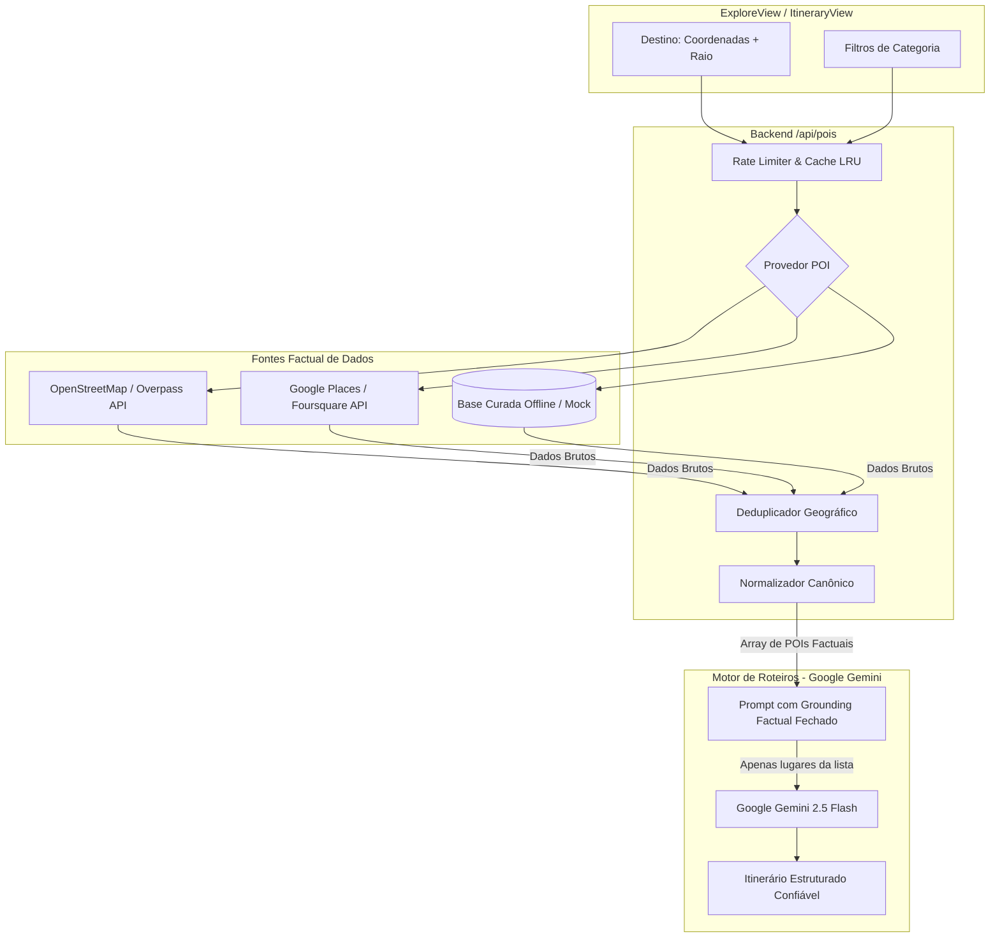

# SPEC: Serviço de Pontos de Interesse (POIs)

**Documento:** `docs/specs/poi-service-spec.md`  
**Status:** Proposto  
**Versão:** 1.0.0  
**Rastreabilidade:** [smarttrip-mestre.md](./smarttrip-mestre.md), [ui-spec.md](./ui-spec.md), [destination-service-spec.md](./destination-service-spec.md), [weather-service-spec.md](./weather-service-spec.md)  
**Objetivo:** Especificar a arquitetura, regras de negócio, modelo de dados normalizado, ancoragem factual para IA (*grounding*), tratamento de duplicidades, segurança de chaves, critérios de aceite e testes para o **Serviço de Pontos de Interesse (POIs)** do SmartTrip.

---

## 1. Visão Geral e Papel Crítico na IA

O Serviço de Pontos de Interesse é o **alicerce factual** que impede o Google Gemini de inventar locais inexistentes, atrações fictícias ou atribuir pontos turísticos a cidades incorretas:



### Regra de Ouro: Ancoragem Factual Fechada (*Strict Grounding*)
> 🔒 **O Google Gemini SÓ PODE utilizar e alocar em um roteiro os lugares reais explicitamente retornados por este serviço.**
> O prompt de IA receberá a lista de POIs normalizados com seus respectivos `id`, `name`, `category`, `address` e `coordinates`. O Gemini é instruído de forma fechada a escolher subconjuntos dessa lista com base no clima e nas preferências do usuário, **sendo estritamente proibido de inventar nomes de locais**.

---

## 2. Parâmetros de Entrada e Validações

### 2.1. Contrato da Requisição

```typescript
export interface PoiSearchRequest {
  latitude: number;             // -90 <= latitude <= 90
  longitude: number;            // -180 <= longitude <= 180
  categories?: PoiCategory[];   // Se omitido, busca todas as categorias suportadas
  radiusMeters?: number;        // Padrão: 5.000m (mín: 500m, máx: 25.000m)
  limit?: number;               // Padrão: 20 (mín: 1, máx: 50)
  language?: string;            // Padrão: 'pt-BR'
  signal?: AbortSignal;
}
```

### 2.2. Categorias Suportadas

O SmartTrip restringe seu universo a 7 categorias essenciais de viagem:

| Categoria Canônica | Rótulo em Português | Exemplos | Mapeamento OpenStreetMap (OSM Tags) |
|---|---|---|---|
| `'atracao'` | Atrações Turísticas | Mirantes, monumentos públicos, pontos de interesse geral | `tourism=attraction`, `tourism=viewpoint` |
| `'praia'` | Praias & Orlas | Praias urbanas, baías, enseadas | `natural=beach`, `leisure=beach_resort` |
| `'museu'` | Museus & Galerias | Museus históricos, pinacotecas, galerias de arte | `tourism=museum`, `tourism=gallery` |
| `'parque'` | Parques & Natureza | Parques urbanos, jardins botânicos, reservas | `leisure=park`, `leisure=garden` |
| `'restaurante'` | Restaurantes | Restaurantes típicos, bistrôs, alta gastronomia | `amenity=restaurant` |
| `'cafe'` | Cafés & Padarias | Cafeterias, confeitarias, lanchonetes artesanais | `amenity=cafe`, `shop=bakery` |
| `'ponto_historico'` | Sítios Históricos | Castelos, catedrais, ruínas, fortes, centros antigos | `historic=*`, `amenity=place_of_worship` |

### 2.3. Validações de Entrada
1. **Coordenadas Geográficas:** Validação estrita de número finito e limites globais (`-90 <= lat <= 90` e `-180 <= lng <= 180`).
2. **Raio de Busca (`radiusMeters`):** Se menor que 500m, assume 500m; se maior que 25.000m (25km), limita em 25.000m para evitar estouro de memória e lentidão.
3. **Categorias Válidas:** Rejeição ou descarte de categorias desconhecidas.

---

## 3. Contrato de Saída Normalizado (SmartTrip POI Contract)

```typescript
export type PoiCategory =
  | 'atracao'
  | 'praia'
  | 'museu'
  | 'parque'
  | 'restaurante'
  | 'cafe'
  | 'ponto_historico';

/**
 * Entidade Canônica de Ponto de Interesse
 */
export interface NormalizedPoi {
  id: string;                         // Identificador único e estável (ex: 'poi_osm_node_123456')
  name: string;                       // Nome factual oficial (ex: 'Museu do Louvre')
  category: PoiCategory;              // Categoria canônica classificada
  address: string;                    // Endereço factual estruturado (rua, bairro, cidade)
  latitude: number;                   // Latitude factual confirmada
  longitude: number;                  // Longitude factual confirmada
  
  // Metadados estritamente necessários para UX e roteirização
  rating?: number;                    // Avaliação média factual (1.0 a 5.0)
  userRatingsTotal?: number;          // Quantidade de avaliações se disponível
  priceLevel?: '$' | '$$' | '$$$' | '$$$$'; // Faixa de preço factual
  openingHours?: string;              // Ex: 'Ter-Dom: 09:00 - 18:00'
  websiteUrl?: string;                // Link oficial factual
  imageUrl?: string;                  // Foto de referência
  distanceMeters?: number;            // Distância calculada a partir do centro da busca
  sourceProvider: string;             // Ex: 'osm' | 'google_places' | 'mock'
  rawPlaceId?: string;                // ID original no provedor para rastreabilidade
}

/**
 * Envelope de resposta do serviço de POIs
 */
export interface PoiSearchResponse {
  center: {
    latitude: number;
    longitude: number;
  };
  radiusMeters: number;
  total: number;
  pois: NormalizedPoi[];
  sourceProvider: string;
  retrievedAt: string;                // ISO 8601
  hasError: boolean;
  errorMessage?: string;
}
```

---

## 4. Regras de Negócio e Tratamento de Dados

### 4.1. Estabilidade de Identificadores (`id`)
1. Todo local retornado **deve possuir um ID determinístico e estável** derivado do provedor:
   - Formato: `poi_[sourceProvider]_[rawId]` (ex: `poi_osm_node_428192` ou `poi_google_ChIJFU6Z...`).
2. Se o provedor não fornecer ID único (ex: bases livres sem chave), o ID é calculado por hash determinístico:
   - `poi_custom_[slug(name)]_[lat.toFixed(4)]_[lng.toFixed(4)]`.
3. Essa regra garante que se o usuário favoritar um POI ou ele for salvo em um itinerário no Firestore, o mesmo lugar possa ser referenciado futuramente sem quebras.

### 4.2. Tratamento de Dados Factuais vs IA
- **Separação Rígida:** Nome, endereço, telefone, site e coordenadas são **fatos geográficos imutáveis** e devem ser fornecidos estritamente pelo provedor de POIs.
- **Vedação de IA:** Em nenhuma hipótese o nome de um POI factual deve ser reescrito ou traduzido por inferência cega de IA para evitar alucinações (ex: transformar "Templo Senso-ji" em "Igreja de Tóquio").

### 4.3. Algoritmo de Deduplicação Geográfica
Em cidades com densidade turística alta ou fontes híbridas, o mesmo local pode aparecer duplicado com variações ortográficas ("Museu do Prado" vs "Museo Nacional del Prado"):
1. **Deduplicação por ID:** Registros com mesmo `rawPlaceId` são imediatamente mesclados.
2. **Deduplicação por Proximidade Espacial e Nome:**
   - Se dois POIs possuem distância inferior a **50 metros** (via fórmula de Haversine);
   - E a similaridade textual do nome (após remoção de acentos e maiúsculas) for superior a **80%**;
   - O sistema mantém o registro com mais metadados preenchidos (foto, horário, site) e descarta o duplicado redundante.

### 4.4. Tratamento de Nenhum Resultado
- Se a busca para determinadas coordenadas e categorias retornar 0 itens (ex: coordenadas em área rural ou no mar):
  - Retornar `{ total: 0, pois: [], hasError: false }`.
  - **Não quebrar o aplicativo**.
  - A interface exibe *Empty State* amigável sugerindo expandir o raio de busca ou selecionar mais categorias.

---

## 5. Resiliência, Rate Limiting e Cache

### 5.1. Cache em Duas Camadas
Pontos de interesse são entidades físicas altamente estáveis (um museu ou parque não muda de endereço repentinamente):
1. **L1 (Cache em Memória LRU):**
   - Chave: `pois_${lat.toFixed(2)}_${lng.toFixed(2)}_${radiusMeters}_${categories.sort().join('_')}`.
   - **TTL:** **24 horas**.
   - Capacidade: 150 consultas recentes em memória.
2. **L2 (Cache Persistente em Firestore):**
   - Coleção de catálogo público `/cachedPois/{poiId}` com TTL de **30 dias**.

### 5.2. Rate Limiting e Throttling
- Provedores públicos como Overpass API (OpenStreetMap) limitam requisições concorrentes e bloqueiam IPs que realizam rajadas.
- O serviço implementa:
  - Fila de espera de no máximo 1 requisição a cada 1.000ms para o mesmo host externo;
  - Timeout de **6.000ms (6 segundos)** por consulta;
  - Se retornar HTTP 429, o serviço devolve os dados em cache ou fallback de base curada local sem travar a navegação.

### 5.3. Segurança: Proteção Estrita de Chaves de API
- **Endpoint Exclusivo de Backend (`/api/pois`):**
  - Componentes de UI jamais chamam diretamente APIs pagas de terceiros (Google Places, Foursquare, etc.).
  - Qualquer chave de API (ex: `GOOGLE_PLACES_API_KEY`) reside estritamente em variáveis de ambiente de backend, sem prefixo `VITE_`.
  - A inspeção do tráfego do navegador expõe apenas a rota interna `/api/pois` do SmartTrip.

---

## 6. Riscos e Mitigações

| ID | Risco Identificado | Impacto | Probabilidade | Estratégia de Mitigação |
|---|---|---|---|---|
| **RK-POI-01** | **Alucinação da IA** (Gemini sugerir restaurante fictício) | Crítico | Média | **Ancoragem estrita (*grounding*):** O prompt de IA contém a lista fechada dos POIs e uma diretiva negativa punitiva contra invenções. |
| **RK-POI-02** | **Sobrecarga / Queda da API Externa** (HTTP 429 / 500) | Alto | Média | Cache LRU de 24h + Fallback para catálogo curado em memória que garante POIs para os destinos do MVP. |
| **RK-POI-03** | **POI Fechado Definitivamente** | Médio | Baixa | Filtragem de estabelecimentos com status operacional encerrado (`permanently_closed`) quando o provedor fornecer. |
| **RK-POI-04** | **Vazamento de Chave de API** | Crítico | Baixa | Endpoint `/api/pois` roda estritamente no servidor, auditando que o bundle client contenha 0 referências a chaves privadas. |
| **RK-POI-05** | **Duplicação de POIs** em áreas densas | Médio | Média | Algoritmo de deduplicação espacial (50m) com comparação textual de similaridade. |

---

## 7. Critérios de Aceite

### CA-POI-001: Busca com Coordenadas Válidas
- **Dado** que o usuário busca POIs para Paris (`lat: 48.8566, lng: 2.3522`) com raio de 5.000m;
- **Quando** o serviço processar a requisição;
- **Então** deve retornar uma lista de POIs normalizados contendo ao menos museus, parques e atrações turísticas;
- **E** cada item deve conter `id`, `name`, `category`, `address`, `latitude` e `longitude`.

### CA-POI-002: Deduplicação de Lugares Idênticos
- **Dado** que o provedor externo retorne dois registros para o "Museu do Louvre" a 15 metros de distância;
- **Quando** o normalizador processar o lote;
- **Então** a lista final deve conter apenas **uma única entrada** para o Louvre, preservando o conjunto mais rico de metadados.

### CA-POI-003: Respeito a Categorias Solicitadas
- **Dado** que o usuário selecione apenas as categorias `['restaurante', 'cafe']`;
- **Quando** o serviço executar a consulta;
- **Então** nenhum museu, parque ou praia deve constar no resultado.

### CA-POI-004: Coordenadas Inválidas
- **Dado** uma requisição com `latitude: 95` ou `longitude: -200`;
- **Quando** o serviço for invocado;
- **Então** deve retornar erro HTTP 400 com código `POI_INVALID_COORDINATES`.

### CA-POI-005: Nenhum Resultado Encontrado
- **Dado** coordenadas no meio do oceano (`lat: 0.0, lng: 0.0`) com raio de 1.000m;
- **Quando** a busca for processada;
- **Então** o serviço deve retornar `status: 200` com `{ total: 0, pois: [] }` sem falhas ou exceções.

### CA-POI-006: Cache de Consultas Repetidas
- **Dado** uma busca por atrações em Roma;
- **Quando** a mesma consulta for disparada dentro da janela de 24 horas;
- **Então** o resultado deve ser retornado instantaneamente da memória sem gerar chamadas ao provedor externo.

### CA-POI-007: Isolamento de Chaves Privadas
- **Dado** a inspeção do bundle de frontend e variáveis públicas;
- **Então** nenhuma chave confidencial de geolocalização ou Places deve estar exposta no cliente.

---

## 8. Plano de Testes Automatizados

A suíte em `test-poi-service.ts` deverá cobrir os seguintes cenários:

| # | Cenário de Teste | Descrição da Validação |
|---|---|---|
| **1** | Coordenadas e Raio Válidos | Retorno de POIs com todos os campos canônicos obrigatórios preenchidos |
| **2** | Coordenadas Inválidas | Rejeição de latitude > 90 ou longitude > 180 com `POI_INVALID_COORDINATES` |
| **3** | Filtro de Categorias | Consulta restrita a `['museu', 'parque']` retorna apenas itens dessas 2 categorias |
| **4** | Deduplicação Espacial | Dois POIs homônimos a menos de 50 metros unificados em um único item |
| **5** | Nenhum Resultado | Coordenadas remotas retornam `{ total: 0, pois: [] }` sem disparar erro de sistema |
| **6** | Cálculo de Distância | Validação de que `distanceMeters` reflete a distância correta a partir do centro |
| **7** | Timeout do Provedor | Provedor com atraso superior a 6s tratado graciosamente com fallback |
| **8** | Provedor Indisponível (500/503) | Retorno seguro com `hasError: true` sem quebrar o ecossistema do SmartTrip |
| **9** | Cache em Memória (L1 Hit) | Segunda chamada idêntica não incrementa o contador de chamadas externas |
| **10**| Endpoint `/api/pois` | Validação de status 200, headers JSON e validação de query parameters |
| **11**| Segurança de Chaves | Garantia de ausência de chaves de API nos metadados ou variáveis client-side |
