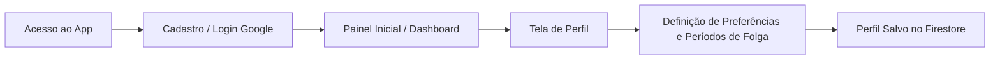
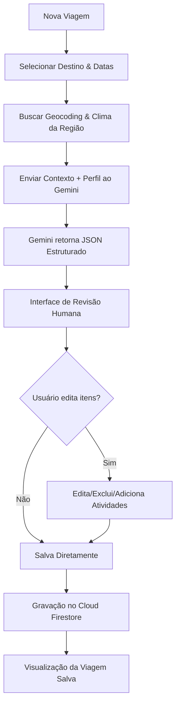
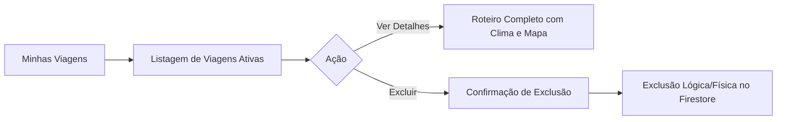
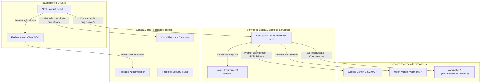
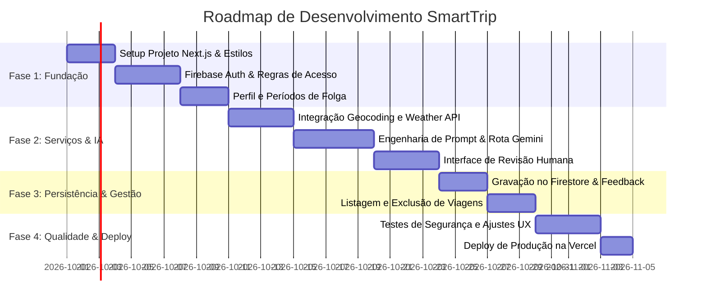

# SPEC Mestre do Produto: SmartTrip

---

## 1. Visão do Produto
O **SmartTrip** é um assistente inteligente de viagens concebido como aplicação web completa, integrando Inteligência Artificial Generativa (Google Gemini) e serviços em nuvem para eliminar a sobrecarga de pesquisa e planejamento enfrentada por viajantes. A plataforma consolida dados contextuais (janelas reais de folga, orçamento, clima local e geolocalização) com enriquecimento via IA para gerar roteiros turísticos personalizados, acionáveis e editáveis em segundos. 

**Declaração de Posicionamento:**
> Para viajantes independentes e profissionais com pouco tempo para planejar viagens, o **SmartTrip** é uma plataforma inteligente de curadoria de itinerários que automatiza a pesquisa de destinos, clima e atrações, combinando IA generativa e controle editorial do próprio usuário, diferentemente de guias estáticos e roteiros genéricos de blogs.

---

## 2. Personas

### Persona 1: Clara Ferreira (A Profissional Ocupada)
- **Perfil:** 29 anos, designer de produto em regime híbrido.
- **Dores:** Tem períodos esparsos de descanso (pontes de feriados e 10 a 15 dias de férias), mas consome horas alternando dezenas de abas (blogs, mapas, previsão do tempo e planilhas). Acaba postergando viagens pela fadiga do planejamento.
- **Objetivos:** Inserir suas datas de folga e perfil ("gosto de cafés, arte contemporânea e caminhadas leves") e obter um itinerário pronto, realista com a previsão meteorológica e adaptável ao seu ritmo.

### Persona 2: Lucas Toledo (O Mochileiro Econômico)
- **Perfil:** 23 anos, estudante universitário.
- **Dores:** Orçamento reduzido e necessidade de priorizar passeios gratuitos ou de baixo custo, sem cair em armadilhas para turistas.
- **Objetivos:** Definir restrições financeiras e estilo "econômico/aventura", descobrindo pontos de interesse e atrações viáveis no destino selecionado, com total clareza dos custos e distâncias relativas.

---

## 3. Objetivos

### 3.1. Objetivos de Negócio / Acadêmicos
- Validar a aplicação prática da IA Generativa (Google Gemini) na consolidação de dados dinâmicos heterogêneos (clima, POIs e preferências).
- Entregar uma arquitetura serverless resiliente, escalável e com custo zero de infraestrutura no tier gratuito (Vercel + Firebase + Google AI Studio).
- Demonstrar uma experiência pontual de curadoria assistida por IA com interface intuitiva e retenção de dados estruturados.

### 3.2. Metas de Sucesso Mensuráveis
- **Tempo Médio de Geração:** Geração de itinerário completo de até 7 dias em menos de 10 segundos.
- **Taxa de Conclusão de Roteiro:** Pelo menos 80% dos roteiros gerados devem ser salvos/revisados pelo usuário sem abandono imediato da tela.
- **Autonomia Editorial:** 100% dos roteiros gerados devem permitir edição humana direta dos itens antes ou após a persistência.

---

## 4. Escopo MVP (Obrigatório)
1. **Autenticação:** Cadastro por e-mail/senha e Google OAuth via Firebase Authentication; logout e recuperação de acesso.
2. **Perfil & Preferências:** Cadastro de preferências de viagem (estilo, ritmo, restrições alimentares, faixa orçamentária) e gerenciamento de períodos de folga/férias.
3. **Busca & Contexto do Destino:** Busca preditiva de destinos com coordenadas geográficas e consulta de previsão climática para o período planejado.
4. **Descoberta de Pontos de Interesse (POIs):** Obtenção de atrações e destaques do destino para alimentar a IA.
5. **Geração com Gemini:** Engenharia de prompt estruturada com JSON Schema obrigatório, produzindo roteiro dia a dia balanceado.
6. **Revisão Humana & Persistência:** Interface de edição do itinerário gerado (adicionar, remover ou ajustar horários e atividades) e salvamento no Cloud Firestore.
7. **Gestão de Roteiros:** Painel com listagem cronológica, visualização detalhada e exclusão de viagens.
8. **Segurança & Deploy:** Firestore Security Rules configuradas por `request.auth.uid`, proteção de chaves de API em variáveis de ambiente de backend e deploy contínuo na Vercel.

---

## 5. Escopo Pós-MVP (Evoluções)
1. **Compartilhamento & Links Públicos:** Links com permissão somente leitura ou chave de visualização temporária.
2. **Feed Social & Exploração:** Área comunitária de roteiros públicos com curtidas e destaques de destinos.
3. **Clonagem de Roteiro ("Fork"):** Capacidade de duplicar um roteiro comunitário para a conta pessoal e customizá-lo.
4. **Colaboração em Grupo:** Criação de viagens em grupo com permissões de coedição multiusuário.
5. **Votação de Atrações:** Enquetes internas do grupo para decidir passeios e restaurantes do dia.
6. **Integração Google Calendar:** Exportação dos blocos diários de atividades direto para a agenda do usuário.
7. **Painel Administrativo:** Gestão de usuários, moderação de conteúdo público e métricas de consumo de tokens Gemini.

---

## 6. Jornadas do Usuário (MVP)

### Jornada 1: Onboarding e Configuração de Perfil


### Jornada 2: Criação, Geração por IA, Revisão e Persistência


### Jornada 3: Consulta e Limpeza de Viagens


---

## 7. Histórias de Usuário (US)

- **US-001:** Como novo viajante, quero me cadastrar com e-mail/senha ou Google, para que meus dados fiquem seguros e acessíveis em qualquer dispositivo.
- **US-002:** Como usuário logado, quero registrar minhas preferências de viagem (estilo, ritmo, restrições) no meu perfil, para não ter que digitá-las repetidamente a cada busca.
- **US-003:** Como usuário logado, quero registrar minhas datas de folga e férias, para que o sistema sugira durações compatíveis com meu tempo livre.
- **US-004:** Como planejador, quero buscar um destino com autocompletar e validação geográfica, para garantir que o roteiro seja gerado para a localidade correta.
- **US-005:** Como viajante, quero visualizar as condições climáticas estimadas para o período da minha viagem, para adequar as expectativas e o vestuário.
- **US-006:** Como usuário, quero solicitar a geração automática de um itinerário personalizado com o Gemini, para economizar tempo de pesquisa.
- **US-007:** Como usuário crítico, quero editar, reorganizar, excluir ou adicionar atividades no roteiro gerado pela IA antes de salvar, para ter controle total sobre meu plano.
- **US-008:** Como usuário, quero salvar o roteiro revisado na minha conta, para acessá-lo offline ou posteriormente.
- **US-009:** Como usuário, quero visualizar uma lista de todas as minhas viagens salvas organizadas cronologicamente, para acompanhar meus planos futuros e históricos.
- **US-010:** Como usuário, quero excluir viagens canceladas ou indesejadas, para manter meu painel limpo e organizado.
- **US-011:** Como usuário, quero encerrar minha sessão com segurança (logout), para evitar acessos indevidos em computadores compartilhados.

---

## 8. Requisitos Funcionais (RF)

- **RF-001:** O sistema deve suportar criação de conta, login e logout via Firebase Authentication com e-mail/senha e provedor Google OAuth.
- **RF-002:** O sistema deve persistir e atualizar o perfil do usuário contendo nome, biografia curta, preferências de viagem (categorias de interesse, nível de orçamento, ritmo) e restrições.
- **RF-003:** O sistema deve permitir o cadastro de múltiplos períodos de folga/férias, compostos por data de início, data de término e descrição opcional.
- **RF-004:** O sistema deve realizar busca de destinos através de API de Geocoding (ex: Nominatim/OpenStreetMap ou Google Places), retornando cidade, país, latitude e longitude.
- **RF-005:** O sistema deve consultar uma API meteorológica (ex: Open-Meteo) com base nas coordenadas do destino e exibir temperatura estimada e condições de tempo para o intervalo de datas.
- **RF-006:** O sistema deve compilar uma lista preliminar de pontos de interesse (POIs) e atrações culturais/turísticas do destino a partir de bases geográficas ou do próprio conhecimento de contexto da IA.
- **RF-007:** O sistema deve invocar o modelo Google Gemini através de uma rota segura de backend (Next.js Route Handler), enviando destino, datas, clima, POIs e perfil do usuário.
- **RF-008:** A resposta do Gemini deve ser estritamente formatada via `response_mime_type: "application/json"` aderente a um JSON Schema predefinido com divisão por dias, períodos (manhã, tarde, noite), atividades, estimativa de duração e dicas.
- **RF-009:** O sistema deve disponibilizar uma interface de revisão que permita ao usuário modificar títulos, descrições, horários, excluir itens sugeridos e incluir novos itens manualmente.
- **RF-010:** O sistema deve salvar o roteiro completo no Cloud Firestore na subcoleção do usuário, mantendo carimbo de data/hora (`createdAt`, `updatedAt`) e metadados de destino.
- **RF-011:** O sistema deve listar todas as viagens do usuário autenticado com filtros rápidos (Próximas, Passadas) e ordenação por data de início.
- **RF-012:** O sistema deve permitir a exclusão de qualquer viagem do próprio usuário, exigindo confirmação explícita na UI.
- **RF-013:** O sistema deve apresentar estados de carregamento estruturados (*skeletons* e indicadores de progresso) durante a busca de dados climáticos e inferência do Gemini.

---

## 9. Requisitos Não Funcionais (RNF)

- **RNF-001 (Desempenho):** O tempo de resposta das APIs internas de orquestração não deve exceder 12 segundos, considerando a latência de chamada do modelo Gemini.
- **RNF-002 (Segurança):** As chaves de API privadas do Firebase Admin, Google Gemini e provedores climáticos jamais devem ser expostas no código cliente/navegador.
- **RNF-003 (Privacidade & Acesso):** As regras do Cloud Firestore devem garantir que nenhum usuário consiga ler, atualizar ou excluir documentos de outro usuário.
- **RNF-004 (Disponibilidade & Escalabilidade):** A aplicação deve ser implantada no modelo serverless na Vercel com escalonamento automático sob demanda e tolerância a picos.
- **RNF-005 (Responsividade & Usabilidade):** A interface deve ser 100% responsiva (Mobile-First), adaptando-se a resoluções a partir de 360px de largura até telas Ultra-Wide.
- **RNF-006 (Acessibilidade):** Elementos interativos devem seguir diretrizes WCAG 2.1 nível AA, incluindo contraste cromático adequado e tags semânticas ARIA.
- **RNF-007 (Manutenibilidade & Tipagem):** O projeto deve ser desenvolvido em TypeScript estrito (`strict: true`), garantindo tipagem consistente de ponta a ponta.

---

## 10. Regras de Negócio (RN)

- **RN-001 (Validação de Datas):** A data de término da viagem deve ser igual ou posterior à data de início. Viagens retroativas não podem ter novos roteiros gerados.
- **RN-002 (Limite de Duração MVP):** O gerador de roteiros com Gemini limita o itinerário a no máximo 7 dias consecutivos por requisição no MVP para evitar estouro de tokens e timeouts de Serverless Functions (limite de 15s na Vercel Free).
- **RN-003 (Propriedade dos Dados):** Um usuário só pode visualizar, editar ou excluir viagens cujo atributo `userId` corresponda estritamente ao seu UID autenticado.
- **RN-004 (Persistência Obrigatória Pós-Revisão):** O roteiro gerado pelo Gemini permanece apenas em memória/estado local da aplicação até que o usuário clique em "Salvar Roteiro". Se a página for recarregada antes do salvamento, o rascunho é descartado.
- **RN-005 (Tratamento de Indisponibilidade Climática):** Caso a API de clima falhe ou a data da viagem seja superior à janela de previsão da API (geralmente > 14 dias), o sistema deve recorrer à média histórica sazonal ou sinalizar "Previsão indisponível" sem interromper o fluxo de geração.
- **RN-006 (Imutabilidade de Histórico Excluído):** A exclusão de uma viagem pelo usuário no MVP é permanente (remoção física do documento no Firestore), sem lixeira temporária.

---

## 11. Arquitetura

### 11.1. Visão Geral da Pilha Tecnológica
- **Frontend / Fullstack:** Next.js (App Router), React, TypeScript.
- **Estilização:** CSS Vanilla estruturado / CSS Modules com Design System baseado em variáveis CSS (design tokens) modernos.
- **Autenticação:** Firebase Authentication (SDK Client para Web).
- **Banco de Dados:** Cloud Firestore (NoSQL, estrutura orientada a documentos).
- **Camada de IA:** Google Gemini API (modelo `gemini-1.5-flash` ou `gemini-2.0-flash` para baixa latência e custo reduzido) via `@google/genai` ou SDK oficial em Route Handlers.
- **Hospedagem & CI/CD:** Vercel (Edge Network e Serverless Functions).

### 11.2. Diagrama de Arquitetura


---

## 12. Modelo de Dados Conceitual (Cloud Firestore)

### 12.1. Estrutura de Coleções e Documentos
Recomenda-se a modelagem baseada na subcoleção do usuário para garantir isolamento e simplicidade nas regras de segurança.

```
/users/{userId}
   ├── (campos de perfil e preferências)
   │
   ├── /vacationPeriods/{periodId}
   │      └── (períodos de folga)
   │
   └── /trips/{tripId}
          └── (roteiros e viagens salvas)
```

### 12.2. Esquema Conceitual dos Documentos

#### Coleção: `users/{userId}`
```typescript
interface UserProfile {
  uid: string;
  email: string;
  displayName: string;
  photoURL?: string;
  createdAt: Timestamp;
  preferences: {
    travelStyle: 'cultura' | 'natureza' | 'gastronomia' | 'aventura' | 'relaxamento';
    budgetLevel: 'economico' | 'moderado' | 'luxo';
    pace: 'tranquilo' | 'moderado' | 'intenso';
    dietaryRestrictions: string[]; // Ex: ["vegetariano", "sem glúten"]
  };
}
```

#### Subcoleção: `users/{userId}/vacationPeriods/{periodId}`
```typescript
interface VacationPeriod {
  id: string;
  startDate: string; // ISO 8601 (YYYY-MM-DD)
  endDate: string;   // ISO 8601 (YYYY-MM-DD)
  description?: string; // Ex: "Recesso de Fim de Ano"
  createdAt: Timestamp;
}
```

#### Subcoleção: `users/{userId}/trips/{tripId}`
```typescript
interface Trip {
  id: string;
  userId: string;
  destination: {
    name: string;        // Ex: "Lisboa, Portugal"
    latitude: number;
    longitude: number;
    country: string;
  };
  startDate: string;     // YYYY-MM-DD
  endDate: string;       // YYYY-MM-DD
  totalDays: number;
  weatherSummary?: {
    avgTempMax: number;
    avgTempMin: number;
    conditions: string; // Ex: "Ensolarado com poucas nuvens"
  };
  itinerary: DayPlan[];
  createdAt: Timestamp;
  updatedAt: Timestamp;
}

interface DayPlan {
  dayNumber: number;
  date: string;
  theme: string; // Ex: "Explorando o Centro Histórico e Belém"
  activities: Activity[];
}

interface Activity {
  id: string;
  period: 'manha' | 'tarde' | 'noite';
  title: string;
  description: string;
  locationName: string;
  estimatedCost?: string;
  tips?: string;
}
```

---

## 13. Integrações

### 13.1. Google Gemini API
- **Endpoint:** `POST https://generativelanguage.googleapis.com/v1beta/models/gemini-1.5-flash:generateContent` (ou via SDK oficial).
- **Finalidade:** Geração inteligente de itinerário estruturado a partir de prompt contextual.
- **Configuração Técnica:** Parâmetros `response_mime_type: "application/json"`, `temperature: 0.7` e envio de `response_schema` restrito correspondente à interface `DayPlan[]`.

### 13.2. Geocoding API (OpenStreetMap Nominatim ou similar)
- **Endpoint:** `GET https://nominatim.openstreetmap.org/search?q={query}&format=json`
- **Finalidade:** Resolução de nomes de cidades/estados para pares de coordenadas (Latitude e Longitude) com precisão.

### 13.3. Weather API (Open-Meteo)
- **Endpoint:** `GET https://api.open-meteo.com/v1/forecast?latitude={lat}&longitude={lon}&daily=temperature_2m_max,temperature_2m_min,weathercode&timezone=auto`
- **Finalidade:** Fornecer dados meteorológicos diários sem necessidade de chave de API paga, suportando previsões até 14 dias ou dados climáticos.

### 13.4. Firebase Authentication & Firestore
- **Finalidade:** Gerenciamento de ciclo de vida do usuário (tokens JWT) e persistência de dados em tempo real sob regras de segurança granulares.

---

## 14. Segurança

### 14.1. Regras de Segurança do Cloud Firestore (`firestore.rules`)
```javascript
rules_version = '2';
service cloud.firestore {
  match /databases/{database}/documents {
    
    // Regra base: bloqueia acesso por padrão
    match /{document=**} {
      allow read, write: if false;
    }
    
    // Regra para Perfil do Usuário
    match /users/{userId} {
      allow read, write: if request.auth != null && request.auth.uid == userId;
      
      // Regra para Períodos de Folga
      match /vacationPeriods/{periodId} {
        allow read, write: if request.auth != null && request.auth.uid == userId;
      }
      
      // Regra para Roteiros e Viagens
      match /trips/{tripId} {
        allow read, write: if request.auth != null && request.auth.uid == userId;
      }
    }
  }
}
```

### 14.2. Práticas de Segurança em Variáveis de Ambiente
- `NEXT_PUBLIC_FIREBASE_*`: Chaves públicas de cliente permitidas no bundle do frontend.
- `GEMINI_API_KEY`: Variável estritamente privada, consumida exclusivamente por Route Handlers em tempo de execução no servidor.
- `FIREBASE_ADMIN_SERVICE_ACCOUNT`: Caso utilizado para operações administrativas, isolada de qualquer exposição pública.

### 14.3. Sanitização e Proteção contra Prompt Injection
- Validação de entrada dos parâmetros de busca (`destination`, restrições) utilizando bibliotecas de validação de esquema (ex: Zod) antes de interpolar nos prompts da IA.

---

## 15. Critérios de Aceite Globais (CA)

- **CA-001:** O usuário não autenticado que tentar acessar as rotas de perfil, planejamento ou minhas viagens deve ser redirecionado para a tela de login.
- **CA-002:** O formulário de geração de viagem só deve ser habilitado se todos os campos obrigatórios (Destino, Data de Início e Data de Término válidas) estiverem preenchidos.
- **CA-003:** O retorno da rota de geração deve ser sempre validado contra o esquema de dados do itinerário; se o JSON vier truncado ou inválido, o sistema deve apresentar mensagem amigável e permitir nova tentativa automática.
- **CA-004:** Durante a revisão do roteiro, a edição de qualquer texto ou exclusão de atividade deve ser refletida na tela imediatamente sem recarregar a página.
- **CA-005:** Ao clicar em "Salvar Roteiro", um indicador de progresso deve ser exibido, e o usuário deve ser redirecionado para a página da viagem com notificação de sucesso.
- **CA-006:** A exclusão de uma viagem deve exibir diálogo modal de confirmação ("Tem certeza que deseja excluir esta viagem?"); após confirmação, o item deve desaparecer da listagem instantaneamente.
- **CA-007:** O deploy na Vercel deve ocorrer sem erros de build TypeScript ou linting, com variáveis de ambiente injetadas no painel da plataforma.

---

## 16. Estratégia de Testes

### 16.1. Testes Unitários
- **Foco:** Funções utilitárias de formatação de datas, cálculo de dias de intervalo, validações de schema com Zod e formatadores de prompt para o Gemini.
- **Ferramentas:** Vitest ou Jest com React Testing Library.

### 16.2. Testes de Integração
- **Foco:** 
  - Chamada à API Route `/api/generate-itinerary` simulando mock do cliente Gemini para validar respostas válidas e tratamento de exceções (HTTP 400, 500).
  - Verificação da camada de comunicação com o Firestore SDK sob cenários autenticados e não autenticados.

### 16.3. Testes End-to-End (E2E)
- **Foco:** Fluxo crítico completo: Login com mock auth -> Cadastro de preferências -> Geração de viagem -> Edição de atividade -> Salvamento -> Verificação na lista -> Exclusão.
- **Ferramentas:** Playwright ou Cypress.

### 16.4. Testes de Regras de Segurança
- **Foco:** Execução de testes automatizados com o emulador local do Firebase (`@firebase/rules-unit-testing`) validando que o `User A` não consegue acessar dados do `User B`.

---

## 17. Riscos e Mitigações

| ID | Risco | Severidade | Probabilidade | Mitigação |
|---|---|---|---|---|
| **RK-001** | Timeout na Vercel Serverless Function por demora do Gemini (limite de 15s no plano hobby) | Alta | Média | Utilizar o modelo mais veloz (`gemini-1.5-flash`), restringir o número de dias do itinerário a no máximo 7 e otimizar o prompt. |
| **RK-002** | Alucinação do Gemini indicando atrações fechadas ou inexistentes | Média | Alta | Inserir no prompt instruções para checar relevância e sugerir validação de horários reais; passar POIs verificados no contexto. |
| **RK-003** | Estouro de cota gratuita da API do Gemini | Alta | Baixa | Implementar rate limiting por IP/usuário e habilitar cache de destinos frequentes se viável. |
| **RK-004** | Falha ou lentidão na API pública de previsão do tempo | Baixa | Média | Fallback gracioso: permitir que o roteiro seja gerado mesmo sem os dados climáticos. |
| **RK-005** | Vazamento acidental de chaves de API | Crítica | Baixa | Auditar `.gitignore`, não prefixar chaves confidenciais com `NEXT_PUBLIC_` e utilizar o gerenciador de secrets da Vercel. |

---

## 18. Fora de Escopo (MVP)

- Reserva direta de hotéis, voos, transfers ou compra de ingressos de atrações.
- Suporte a múltiplos idiomas e conversão de moedas em tempo real.
- Aplicativo móvel nativo (iOS / Android nativo via Swift/Kotlin) — foco exclusivamente em Web Responsivo.
- Funcionalidades colaborativas em tempo real (edição simultânea estilo Google Docs).
- Sistema de pagamentos ou planos de assinatura.

---

## 19. Roadmap Incremental



- **Sprint 1 (Fundação & Identidade):** Configuração do repositório Next.js, arquitetura de design tokens, autenticação Firebase (Google + e-mail) e CRUD do perfil com preferências e folgas.
- **Sprint 2 (Contexto & IA Generativa):** Conexão com Nominatim e Open-Meteo, criação do Route Handler seguro de integração com o Gemini, definição do JSON Schema e tela de revisão editável.
- **Sprint 3 (Persistência & Ciclo de Vida do Roteiro):** Gravação no Firestore, tela de listagem de viagens ("Minhas Viagens"), visualização dos detalhes e ação de exclusão com confirmação.
- **Sprint 4 (Polimento, Segurança e Lançamento):** Implementação das Firestore Security Rules, tratamento de estados de erro/loading, testes automatizados e deploy na Vercel com domínio funcional.

---

## 20. Definition of Done (DoD)

Para que qualquer funcionalidade ou User Story do SmartTrip seja considerada **concluída**, os seguintes critérios devem ser estritamente atendidos:

1. **Tipagem e Compilação:** Código TypeScript compilado sem erros de build (`next build` bem-sucedido) e sem utilização de tipagem permissiva indevida (`any`).
2. **Design e Responsividade:** Interface validada e fluida em resoluções mobile (360px+) e desktop, respeitando os tokens de design do sistema sem quebras visuais.
3. **Segurança de Acesso:** Leitura e escrita validadas pelas regras de segurança do Firestore, assegurando que nenhum dado pessoal ou roteiro seja legível por terceiros.
4. **Resiliência a Falhas:** Presença de tratamento visual para estados vazios (*empty states*), estados de carregamento (*skeletons* / *spinners*) e mensagens amigáveis em caso de falha de conexão ou timeout da IA.
5. **Revisão Humana Preservada:** Toda atividade gerada deve ser passível de edição direta antes do commit no banco de dados.
6. **Código Limpo e Documentado:** Código aderente às boas práticas, com nomenclatura clara de componentes e funções.
7. **Deploy Homologado:** Alterações sincronizadas com a branch principal e disponibilizadas no ambiente de produção na Vercel sem regressões funcionais.
